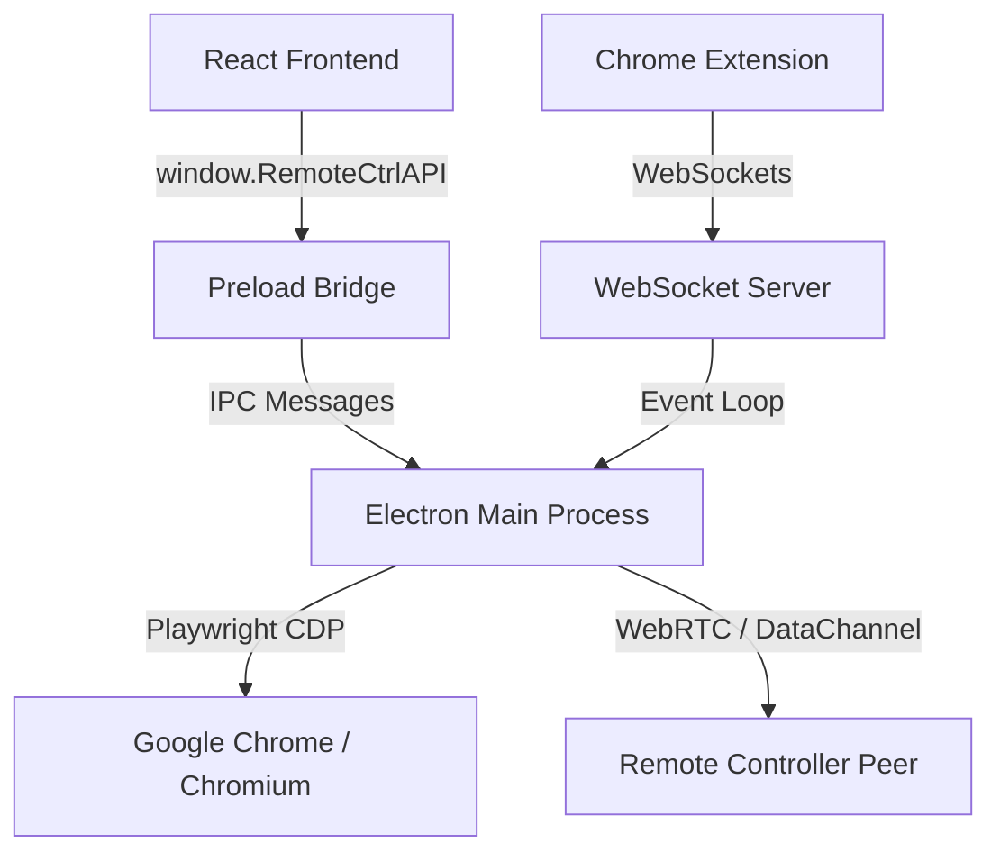

# Architecture Overview

RemoteCtrl is a cross-platform remote browser control desktop application constructed with **Electron**, **React**, **TypeScript**, **Playwright**, and **WebRTC**.

The application is split into three core layers to enforce strict process boundary isolation: **Main Process** (Node.js backend), **Preload Bridge** (Context isolation), and **Renderer Process** (React frontend).

---

## 1. Directory Structure

The codebase is organized as follows:

*   **`src/main/`**: Node.js execution environment (Electron Main). Handles automation engine runs, filesystem access, encryption, and WebRTC protocols.
*   **`src/preload/`**: The security gateway. Exposes safe IPC bindings to the renderer context.
*   **`src/renderer/`**: Client browser environment (React). Renders viewport canvases, settings panels, chat logs, and workflow editors.
*   **`src/shared/`**: Common schemas, types, and defaults imported by both Main and Renderer.

---

## 2. Process Separation & Security Boundary

To comply with Chromium and Electron security best practices, the Renderer process runs with `nodeIntegration: false` and `contextIsolation: true`. 

### The Preload Seam
Communication between React and Node occurs exclusively via the secure context bridge defined in `src/preload/index.cjs`. This file exposes specific, Zod-guarded system methods on `window.RemoteCtrlAPI`, preventing the frontend from invoking arbitrary shell scripts or Node APIs.

### IPC Validation
All requests received by the Main process from the Renderer process are validated in the `src/main/ipc/` handlers using structural Zod schemas defined in `src/shared/schemas.ts`. If any validation fails, the request is immediately quarantined to prevent code injection attacks.

---

## 3. Communication Pipelines

RemoteCtrl orchestrates three primary communication pipelines:

1.  **Renderer ↔ Main (IPC)**: Synchronous and asynchronous events (e.g. triggering an agent, loading settings, saving workflows).
2.  **Main ↔ Chrome (Playwright CDP)**: Connecting over Chromium DevTools Protocol (CDP) to track tabs, trigger actions, and stream screencast frame buffers.
3.  **Host ↔ Controller (WebRTC)**: Peer-to-peer data channels streaming real-time video frames and forwarding mouse clicks, scrolls, and keystrokes.
