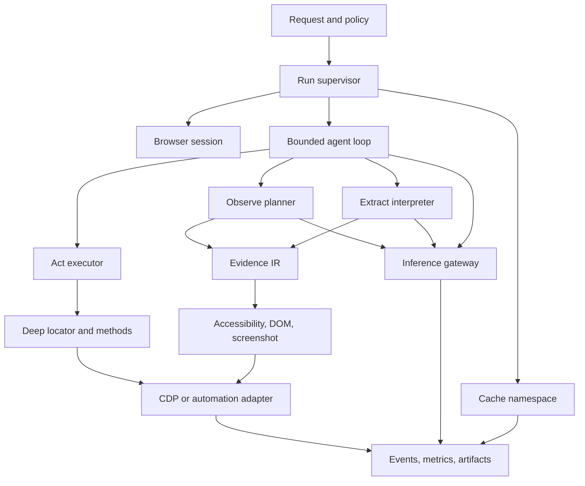

# Stagehand Agentic Architecture: Technical Research and Adaptation Playbook

Research date: 2026-07-19.
Upstream snapshot: Browserbase Stagehand repository commit `06289148e4193d67371f07bd80a58e3268520260`.
Scope: upstream Stagehand TypeScript architecture and the official Stagehand and Browserbase documentation.
Constraint: this document intentionally contains no analysis of the current workspace or any downstream implementation.

## Executive thesis

Stagehand is best understood as an intent-to-browser execution stack, not as an autonomous model alone.
Its durable design move is to place a narrow semantic boundary between language intent and browser mechanics.
The public primitives are `act`, `observe`, and `extract`, while `agent` composes those capabilities into a loop.
The browser remains an imperative system whose state must be inspected, resolved, mutated, and re-inspected.
The model proposes typed intent; Stagehand owns selectors, CDP sessions, frame identity, timing, and cleanup.
That ownership is the main source of reliability compared with passing raw screenshots to a free-form model.
The repository calls the low-level browser layer “Understudy,” signaling that the AI layer is not the browser driver.
The V3 entry point delegates lifecycle and primitive routing rather than embedding page-specific automation policy.
Local Chrome and Browserbase sessions share the same internal CDP-oriented abstractions after initialization.
The Browserbase API path adds a remote execution boundary without changing the conceptual primitive contract.
The result is a hybrid system: deterministic code around nondeterministic inference, with cache and healing seams.

The central architecture can be summarized as five contracts.

1. A browser contract exposes targets, sessions, frames, DOM, accessibility, input, and navigation through CDP.
2. A snapshot contract converts unstable browser state into compact, addressable model context.
3. An inference contract maps natural language to validated actions or schema-shaped data.
4. An execution contract resolves semantic targets into browser operations and reports structured outcomes.
5. A lifecycle contract guarantees initialization, reuse, observability, timeout behavior, and teardown.

The most important implication for adaptation is that a Stagehand-like system should preserve these contracts.
Replacing a provider, browser host, or orchestration framework is safer than collapsing all boundaries into one agent.
The design also implies a practical operating model: explore with AI, stabilize with actions, and verify outcomes.

Sources: [Stagehand repository README](https://github.com/browserbase/stagehand/blob/06289148e4193d67371f07bd80a58e3268520260/README.md), [Stagehand introduction](https://docs.stagehand.dev/v3/first-steps/introduction.md), [Browserbase overview](https://docs.browserbase.com/welcome/what-is-browserbase).

## Research method and evidence discipline

The primary source was the upstream GitHub repository at the pinned commit listed above.
Repository observations were derived from package boundaries, TypeScript types, handlers, lifecycle code, and evals.
Official docs were used to validate public behavior, configuration claims, and intended user-facing workflows.
Claims about private mechanics are labeled as implementation observations rather than product guarantees.
Claims about performance are treated as directional unless the source exposes a reproducible benchmark.
Examples in this report are architectural pseudocode, not copied source code.
Any URL in a citation points to an upstream file or official documentation page for follow-up inspection.

The pinned commit matters because Stagehand is actively evolving and its public documentation spans multiple versions.
The repository package currently identifies the core package as version `3.7.0` at this snapshot.
The report therefore focuses on V3 semantics and notes where API mode or legacy compatibility changes the path.
The official docs index explicitly separates V3 basics, best practices, configuration, references, and SDKs.
That separation is useful evidence of the intended layering: concepts first, knobs second, wire contracts third.

Sources: [Stagehand V3 docs index](https://docs.stagehand.dev/llms.txt), [Stagehand package metadata](https://github.com/browserbase/stagehand/blob/06289148e4193d67371f07bd80a58e3268520260/packages/core/package.json), [Stagehand V3 reference](https://docs.stagehand.dev/v3/references/stagehand.md).

## Layered architecture

### Layer 0: hosted or local browser runtime

At the bottom is Chromium, either launched locally or provisioned by Browserbase.
The runtime owns tabs, documents, frame trees, JavaScript execution contexts, network events, and pixels.
Stagehand does not abstract the browser into a fictional document database; it keeps a live connection.
The connection is a CDP WebSocket, and the browser is addressed through target-scoped sessions.
Browserbase adds session creation, cloud identity, recording, replay, and remote resource controls.
Local mode adds Chrome launch options, temporary profiles, user data directories, and external CDP attachment.

This layer is inherently stateful and asynchronous.
Navigation can replace the execution context while preserving a target identity.
An iframe can run in the same target session or in an out-of-process iframe session.
Popups can be created, attached, navigated, and destroyed faster than a high-level call completes.
Network requests can outlive the user-visible page transition.
These facts explain why a robust architecture needs event bridges and registries below the AI boundary.

Browserbase sessions are the unit of cloud isolation and billing, while Stagehand pages are top-level targets.
The distinction is important: one browser session may contain multiple tabs, and one tab may contain many frames.

Sources: [Browser session fundamentals](https://docs.browserbase.com/platform/browser/getting-started/using-browser-session), [local and remote browser configuration](https://docs.stagehand.dev/v3/configuration/browser.md), [Stagehand context implementation](https://github.com/browserbase/stagehand/blob/06289148e4193d67371f07bd80a58e3268520260/packages/core/lib/v3/understudy/context.ts).

### Layer 1: CDP transport and target ownership

The `CdpConnection` layer sends protocol commands and dispatches events to root and child sessions.
`V3Context` attaches to targets, enables auto-attach, and maintains reverse maps from targets and frames.
Each top-level target gets one internal `Page` object.
Each page owns its top-level session and any adopted OOPIF child sessions.
Each frame operation must use the session that owns that frame’s identifier.
This owner-session rule avoids a subtle class of cross-session CDP failures.

`V3Context` keeps `pagesByTarget`, `mainFrameToTarget`, `sessionOwnerPage`, and `frameOwnerPage` indexes.
It also tracks pending OOPIF attachments while a parent frame event catches up.
The maps are not just caches; they encode ownership needed to route protocol events correctly.
The context chooses an active page using a recency order updated on target attachment and explicit selection.
When a page disappears, target cleanup removes it from every relevant index.

The architecture favors explicit ownership over querying the browser on every operation.
That trades some bookkeeping complexity for predictable routing under frame and popup churn.
The same pattern is applicable to any remote browser adapter with nested execution contexts.

Sources: [V3Context implementation](https://github.com/browserbase/stagehand/blob/06289148e4193d67371f07bd80a58e3268520260/packages/core/lib/v3/understudy/context.ts), [CDP-backed Page implementation](https://github.com/browserbase/stagehand/blob/06289148e4193d67371f07bd80a58e3268520260/packages/core/lib/v3/understudy/page.ts), [Frame implementation](https://github.com/browserbase/stagehand/blob/06289148e4193d67371f07bd80a58e3268520260/packages/core/lib/v3/understudy/frame.ts).

### Layer 2: Understudy browser façade

The internal `Page`, `Frame`, `Locator`, and selector resolver form a browser façade optimized for Stagehand.
The façade exposes Playwright-like concepts while speaking CDP directly in the V3 path.
`Page` owns navigation, screenshots, input helpers, frame topology, and target-specific session handles.
`Frame` owns frame-scoped evaluation, accessibility calls, screenshots, and child-frame traversal.
`Locator` resolves an XPath or CSS-like target at execution time rather than retaining a stale element handle.
The deep locator path can cross iframe hops and shadow boundaries when the snapshot supplies the right path.

The façade is deliberately narrower than a complete browser framework.
It supplies the operations required by semantic actions, agent tools, extraction, and diagnostics.
The benefit is that Stagehand can enforce its own timing, logging, and frame ownership invariants.
The cost is a second compatibility surface beside Playwright and Puppeteer.
Stagehand therefore includes bridges that accept external page objects and normalize them to main-frame IDs.

This layer is the appropriate seam for adaptation when the downstream system already owns a browser.
An adapter should preserve the semantic `Page` contract even if its transport uses Playwright or WebDriver.

Sources: [Stagehand Page reference](https://docs.stagehand.dev/v3/references/page.md), [Locator reference](https://docs.stagehand.dev/v3/references/locator.md), [deep locator reference](https://docs.stagehand.dev/v3/references/deeplocator.md), [Understudy source tree](https://github.com/browserbase/stagehand/tree/06289148e4193d67371f07bd80a58e3268520260/packages/core/lib/v3/understudy).

### Layer 3: snapshot and evidence construction

Snapshot construction is the translation boundary between browser state and model-visible context.
Stagehand’s hybrid snapshot combines accessibility semantics with DOM-derived addressing data.
The accessibility side contributes roles, names, values, states, hierarchy, and link URLs.
The DOM side contributes tag names, scrollability, backend node identifiers, and XPaths.
The two views are joined through frame-aware encoded IDs.
The model receives a textual outline rather than raw protocol objects.
The executor later maps those IDs back to selectors using the snapshot’s lookup maps.

The snapshot pipeline is layered to avoid repeating expensive DOM work.
It builds one DOM index per unique CDP session and slices that index for each frame.
It can narrow capture to a selector or ignore selected subtrees before producing the model payload.
It computes iframe prefixes so a frame-local XPath can become a cross-frame path.
It injects child-frame outlines under the accessibility node representing the iframe host.

This design creates a stable “address now, execute later” protocol.
The address is not a permanent selector; it is a bridge across one snapshot and one action.
That distinction is critical for reasoning about cache invalidation and self-healing.

Sources: [snapshot capture implementation](https://github.com/browserbase/stagehand/blob/06289148e4193d67371f07bd80a58e3268520260/packages/core/lib/v3/understudy/a11y/snapshot/capture.ts), [snapshot tree formatting](https://github.com/browserbase/stagehand/blob/06289148e4193d67371f07bd80a58e3268520260/packages/core/lib/v3/understudy/a11y/snapshot/treeFormatUtils.ts), [Observe docs](https://docs.stagehand.dev/v3/basics/observe.md).

### Layer 4: primitive handlers

`ObserveHandler` captures a hybrid snapshot, asks a model for candidate elements, and resolves IDs to selectors.
`ActHandler` performs either a fresh semantic inference or a deterministic action supplied by the caller.
`ExtractHandler` captures context, asks for a schema-shaped result, and repairs URL fields through ID maps.
The handlers own prompt assembly, model selection, timeout guards, metrics hooks, and primitive-specific errors.
The handler boundary prevents V3 orchestration from knowing the details of each inference schema.

Primitive handlers distinguish proposal from execution.
The model proposes an element ID, method, and arguments.
Stagehand validates the structured response and resolves the ID through a current snapshot map.
The browser façade performs the method through a known operation map.
The result records success, message, description, and actions that can later be replayed.

This is a form of typed action planning with late binding.
The type is not merely a JSON schema; it also restricts the supported method vocabulary.
Late binding is what permits the same public prompt to survive a moderate layout change.

Sources: [observe handler](https://github.com/browserbase/stagehand/blob/06289148e4193d67371f07bd80a58e3268520260/packages/core/lib/v3/handlers/observeHandler.ts), [act handler](https://github.com/browserbase/stagehand/blob/06289148e4193d67371f07bd80a58e3268520260/packages/core/lib/v3/handlers/actHandler.ts), [extract handler](https://github.com/browserbase/stagehand/blob/06289148e4193d67371f07bd80a58e3268520260/packages/core/lib/v3/handlers/extractHandler.ts).

### Layer 5: V3 orchestration

`V3` constructs handlers, resolves models, selects a browser environment, and manages lifecycle.
It exposes `init`, `context`, `act`, `observe`, `extract`, `agent`, `connectURL`, metrics, history, and `close`.
It owns the choice between local inference and the Stagehand API path.
It also owns local and server caches, flow logging, shutdown supervision, and page normalization.

V3 is a policy coordinator rather than a giant execution function.
Its private state tracks initialization kind, handlers, context, model clients, caches, and shutdown state.
Public methods resolve a page, normalize arguments, select the API or local handler, and record history.
This is a relatively deep module because callers do not need to know how a browser was launched or attached.
The module can therefore absorb browser-host differences without changing `act` call sites.

An adaptation should preserve the same invariant: primitive users should not branch on local versus cloud.
Environment-specific differences belong at initialization and transport boundaries.

Sources: [V3 implementation](https://github.com/browserbase/stagehand/blob/06289148e4193d67371f07bd80a58e3268520260/packages/core/lib/v3/v3.ts), [Stagehand API reference](https://docs.stagehand.dev/v3/references/stagehand.md), [quickstart](https://docs.stagehand.dev/v3/first-steps/quickstart.md).

### Layer 6: API server and session store

The repository also contains a V3 Fastify server that exposes session start, navigate, observe, act, extract, agent, replay, and end routes.
The server validates requests with Zod/OpenAPI schemas before invoking a session-bound V3 instance.
The client uses streamed responses so logs and completion state can arrive over one request.
The server’s `SessionStore` interface separates session configuration persistence from V3 instance lifetime.
The default in-memory store adds lazy initialization, LRU eviction, optional TTL cleanup, and per-request logger replacement.

This makes API mode a stateful control plane over otherwise stateful browser resources.
The store is deliberately replaceable so stateless pods can externalize session metadata and ownership.
The V3 client sends a session identifier, model metadata, cache headers, and SDK version on each operation.
The API server resolves the correct page using a supplied main-frame ID or the active page.

This layer is not required for local embedding, but it becomes important for multi-tenant deployment.
It also moves caching, model routing, and observability into a service boundary where policy can be centralized.

Sources: [server entry point](https://github.com/browserbase/stagehand/blob/06289148e4193d67371f07bd80a58e3268520260/packages/server-v3/src/server.ts), [SessionStore contract](https://github.com/browserbase/stagehand/blob/06289148e4193d67371f07bd80a58e3268520260/packages/server-v3/src/lib/SessionStore.ts), [in-memory session store](https://github.com/browserbase/stagehand/blob/06289148e4193d67371f07bd80a58e3268520260/packages/server-v3/src/lib/InMemorySessionStore.ts).

### Layer 7: agent loop and integrations

The standard V3 agent uses the AI SDK tool loop over DOM or hybrid browser tools.
The agent prepares a mode-aware system prompt, creates tools, runs model steps, and records tool outcomes.
The tool set includes navigation, semantic actions, accessibility tree, extraction, screenshots, scroll, keys, wait, and thought.
Hybrid mode adds coordinate tools such as click, type, drag-and-drop, click-and-hold, and visual form filling.
MCP integrations and custom tools expand the action space outside the browser.

The agent layer is intentionally above the primitives.
An `act` tool calls V3 `act`; an `extract` tool calls V3 `extract`; an accessibility tool calls no new inference.
This means the agent can benefit from primitive-level caching and healing without reimplementing them.
The loop tracks actions, reasoning text, final completion, usage, messages, and optional evidence callbacks.
The `done` tool creates an explicit completion boundary rather than treating any final text as success.

The architecture supports different model boundaries for planning and execution.
An agent model can choose tools, while an execution model can be used by a semantic action tool.
That split allows a strong planner to delegate low-level targeting to a cheaper or more specialized model.

Sources: [V3 agent handler](https://github.com/browserbase/stagehand/blob/06289148e4193d67371f07bd80a58e3268520260/packages/core/lib/v3/handlers/v3AgentHandler.ts), [agent tool registry](https://github.com/browserbase/stagehand/blob/06289148e4193d67371f07bd80a58e3268520260/packages/core/lib/v3/agent/tools/index.ts), [agent docs](https://docs.stagehand.dev/v3/basics/agent.md).

## Architectural invariants

The browser transport is authoritative for page state.
The snapshot is authoritative only for the inference moment that produced it.
The model is authoritative for semantic choice within the permitted action vocabulary.
The executor is authoritative for whether an action was attempted and whether the browser accepted it.
The application remains authoritative for business success and irreversible side effects.

That last boundary is easy to miss.
An action result saying that a button was clicked is not proof that an order was placed.
An extraction result passing a schema is not proof that the data is complete or fresh.
An agent result marked completed is not proof that a downstream business invariant holds.
Stagehand’s primitives are control and interpretation mechanisms, not domain-level transactions.

The most reliable adaptation keeps a verification step outside the model loop.
The verifier should inspect page state or an application API after meaningful actions.
It should distinguish “interaction succeeded” from “goal predicate satisfied.”

Sources: [act reference](https://docs.stagehand.dev/v3/references/act.md), [extract reference](https://docs.stagehand.dev/v3/references/extract.md), [agent completion guidance](https://docs.stagehand.dev/v3/best-practices/prompting-best-practices.md).

## Browser, page, and session lifecycle

### Construction versus initialization

Constructing V3 records options and prepares model-related dependencies.
Calling `init()` creates primitive handlers before connecting to the browser.
The separation allows failures to be classified as configuration, browser, transport, or handler failures.
It also keeps a constructed instance inert until the caller explicitly starts external resources.
Methods reject use before initialization with a typed not-initialized error.

Initialization first selects `LOCAL` or `BROWSERBASE` from options.
Local mode can attach to an existing CDP URL or launch Chrome with a temporary profile.
Browserbase mode resolves credentials, creates or resumes a cloud session, and obtains a connect URL.
The V3 context then connects to CDP and waits for at least one top-level page.
If no page appears within the configured first-page window, context creates an `about:blank` page.

The first page guarantee simplifies every primitive call.
Callers can ask for the active page immediately after `init()` without handling an empty tab set.
The guarantee is implemented as a bounded wait plus a fallback page creation, not an assumption about Chrome startup.

Sources: [V3 initialization](https://github.com/browserbase/stagehand/blob/06289148e4193d67371f07bd80a58e3268520260/packages/core/lib/v3/v3.ts), [context creation](https://github.com/browserbase/stagehand/blob/06289148e4193d67371f07bd80a58e3268520260/packages/core/lib/v3/understudy/context.ts), [Stagehand lifecycle reference](https://docs.stagehand.dev/v3/references/stagehand.md).

### Local launch path

Local launch creates a temporary profile if the caller does not supply a user data directory.
The profile can be preserved or removed according to `preserveUserDataDir` and temporary-profile state.
The launcher returns both a WebSocket endpoint and a Chrome process handle.
The process can be unreferenced when `keepAlive` is requested.
When keep-alive is disabled, Stagehand starts a crash-only shutdown supervisor.
The supervisor exists because normal `finally` cleanup cannot run after an abrupt process exit.

Local attachment to a caller-owned CDP endpoint uses a no-op kill stub for the external browser.
That distinction prevents Stagehand from terminating a browser it did not launch.
Post-connect options such as download behavior are applied through CDP when possible.
The adaptation lesson is to model ownership explicitly rather than infer it from connection type.

Sources: [local browser launcher](https://github.com/browserbase/stagehand/blob/06289148e4193d67371f07bd80a58e3268520260/packages/core/lib/v3/launch/local.ts), [shutdown supervisor](https://github.com/browserbase/stagehand/blob/06289148e4193d67371f07bd80a58e3268520260/packages/core/lib/v3/shutdown/supervisorClient.ts), [user data guidance](https://docs.stagehand.dev/v3/best-practices/user-data.md).

### Browserbase launch path

Browserbase initialization can use the Stagehand API or direct Browserbase session control.
The API path starts a Stagehand session record and may let the service select the model.
The browser path creates or resumes the Browserbase session and attaches through CDP.
Stagehand marks the session metadata so Browserbase can identify it as Stagehand-controlled.
The configured viewport is normalized when the cloud session is created.
Session and debugger URLs are retained for diagnostics and operational links.

If the API is unavailable, a concrete model can permit a local SDK path while `auto` cannot.
This is a meaningful boundary: automatic model routing is a service capability, not a property of a local client.
When keep-alive is false, Stagehand arranges API-backed cleanup for the cloud session.
When a caller resumes a session, cleanup decisions must avoid ending a resource owned by someone else.

Sources: [Browserbase launch implementation](https://github.com/browserbase/stagehand/blob/06289148e4193d67371f07bd80a58e3268520260/packages/core/lib/v3/launch/browserbase.ts), [Browserbase session creation](https://docs.browserbase.com/platform/browser/getting-started/create-browser-session), [Browserbase keep-alive](https://docs.browserbase.com/platform/browser/long-sessions/keep-alive).

### Target attachment and pre-resume ordering

Context enables target auto-attach before replaying existing targets.
For a newly attached web target, Stagehand registers event listeners and execution-context tracking.
It enables Page, Runtime, and child-target auto-attach domains.
It installs headers, domain policy interception, user init scripts, and the DOM piercer before resume.
It resumes a paused target only after the critical setup commands have been dispatched.
This ordering protects document-start hooks from racing the first page script.

Some CDP backends defer command responses while a target is paused.
Stagehand therefore distinguishes “command dispatched” from “command response received.”
It queues setup operations, waits for transport dispatch, resumes the target, and then awaits responses.
This is a subtle but reusable pattern for protocols with debugger-paused sessions.

After resume, top-level targets become `Page` objects and child targets are adopted as OOPIF sessions.
If a child target cannot yet identify its owner, context stages it by child main-frame ID.
When the parent emits `frameAttached`, context completes adoption and installs event bridges.

Sources: [target attach lifecycle](https://github.com/browserbase/stagehand/blob/06289148e4193d67371f07bd80a58e3268520260/packages/core/lib/v3/understudy/context.ts), [CDP protocol overview](https://chromedevtools.github.io/devtools-protocol/), [frame registry](https://github.com/browserbase/stagehand/blob/06289148e4193d67371f07bd80a58e3268520260/packages/core/lib/v3/understudy/frameRegistry.ts).

### Page identity and activity

A Stagehand `Page` corresponds to one top-level target, not one URL.
The URL can change through navigation while the page object remains the owner of the target.
The main frame ID can also change during a root-frame swap, so context updates the main-frame mapping.
Page order tracks recency rather than relying only on creation time.
Opening a new page makes it active, and selecting an existing page can activate it and request focus.
Closing a target removes the page, target metadata, frame ownership, and staged child relationships.

The active-page convention is convenient for simple scripts but is dangerous for concurrent multi-tab agents.
An agent that opens a popup should capture the intended page reference before issuing another tool call.
An adaptation should make page identity explicit in task state when tabs matter.
The multiple-tabs documentation reinforces this distinction by recommending direct page references for scoped work.

Sources: [multiple tabs guidance](https://docs.stagehand.dev/v3/best-practices/using-multiple-tabs.md), [context page management](https://github.com/browserbase/stagehand/blob/06289148e4193d67371f07bd80a58e3268520260/packages/core/lib/v3/understudy/context.ts), [Page reference](https://docs.stagehand.dev/v3/references/page.md).

### Frame and OOPIF lifecycle

Frames are indexed by frame ID and associated with an owning CDP session.
Same-process iframes share a session but still need a frame-scoped execution context.
OOPIFs use child sessions, so their CDP calls must not be sent through the parent session.
`FrameRegistry` stores topology and session ownership together for the page.
Page event handlers stamp frame ownership using the session that emitted the event.
This prevents context from guessing ownership based on stale frame trees.

When a frame navigates, its execution context is replaced.
Frame evaluation obtains the current main-world context ID and retries once after a context-not-found error.
When a frame detaches, its registry subtree is pruned unless the event represents a root swap.
The system thus treats frame handles as renewable references rather than durable DOM objects.

Sources: [FrameRegistry implementation](https://github.com/browserbase/stagehand/blob/06289148e4193d67371f07bd80a58e3268520260/packages/core/lib/v3/understudy/frameRegistry.ts), [frame evaluation](https://github.com/browserbase/stagehand/blob/06289148e4193d67371f07bd80a58e3268520260/packages/core/lib/v3/understudy/frame.ts), [iframe integration](https://docs.stagehand.dev/v3/integrations/playwright.md).

### Navigation lifecycle

Navigation is a browser operation first and an AI operation only when the caller asks for semantic routing.
`goto` accepts a URL and delegates to the page navigation machinery.
The page tracks lifecycle events, network responses, and navigation sequence IDs.
Navigation responses can be null for same-document or non-network changes.
The page abstraction exposes wait states so callers can choose load, DOM content loaded, or network idle.

Semantic action execution may wait for DOM and network quiet before snapshotting.
That wait is intentionally bounded because modern applications can maintain long-lived connections forever.
It ignores WebSocket and EventSource requests and force-completes stalled iframe documents after a shorter threshold.
The architecture is therefore “best-effort stabilization,” not a claim that the page ever becomes globally idle.

Sources: [navigation and lifecycle helpers](https://github.com/browserbase/stagehand/tree/06289148e4193d67371f07bd80a58e3268520260/packages/core/lib/v3/understudy), [speed optimization](https://docs.stagehand.dev/v3/best-practices/speed-optimization.md), [response reference](https://docs.stagehand.dev/v3/references/response.md).

### Teardown lifecycle

`close()` is idempotent for normal repeated calls and has a force path for crash-triggered cleanup.
It first unhooks the transport-close handler to avoid a recursive close cascade.
It ends the Browserbase session when the API client owns cleanup and keep-alive is disabled.
It closes flow logging, the CDP context, locally launched Chrome, and temporary profiles on a best-effort basis.
Finally it stops the shutdown supervisor, resets state, removes event listeners, destroys the event store, and clears history.

The order matters because ending a cloud session can itself close CDP.
The transport callback must not re-enter teardown while teardown is already in flight.
Cleanup errors are generally swallowed after being logged because partial teardown is safer than process blockage.
An adaptation should expose ownership-aware shutdown and test it under both normal and transport-closed paths.

Sources: [V3 close implementation](https://github.com/browserbase/stagehand/blob/06289148e4193d67371f07bd80a58e3268520260/packages/core/lib/v3/v3.ts), [Browserbase manage session](https://docs.browserbase.com/platform/browser/getting-started/manage-browser-session), [Stagehand lifecycle best practices](https://docs.stagehand.dev/v3/references/stagehand.md).

## `observe()` as a planner and locator compiler

`observe()` answers the question “which executable elements satisfy this description?”
Its output is an array of structured actions, each with a selector, description, method, and arguments.
The default instruction asks for a comprehensive set of potentially useful interactive elements.
The caller can provide a narrower instruction, selector, ignore selectors, variables, model, and timeout.

The method is useful for exploration, plan construction, preflight validation, and cache priming.
It is not the correct primitive for information-only questions.
Calling observe to obtain a count or title introduces unnecessary action semantics and model cost.
Calling extract to locate a button confuses data interpretation with target discovery.

The most efficient pattern is one observation followed by multiple deterministic acts.
The model call pays for discovering several actions, and the subsequent actions reuse the typed output.
The docs describe this pattern as materially faster than one fresh semantic act per field.

Sources: [Observe basics](https://docs.stagehand.dev/v3/basics/observe.md), [Observe API reference](https://docs.stagehand.dev/v3/references/observe.md), [speed optimization](https://docs.stagehand.dev/v3/best-practices/speed-optimization.md).

### Observe inference boundary

The observation schema requires an array of elements with a frame-aware `elementId`.
The model receives the accessibility outline and the supported action vocabulary.
It is instructed to return the full encoded ID, not only the backend node suffix.
After inference, the handler looks up each ID in the combined XPath map.
Actions whose IDs cannot resolve are filtered rather than fabricated.
Drag-and-drop arguments receive the same ID-to-XPath conversion for the target element.

This two-stage mapping limits a model’s ability to invent arbitrary selectors.
It also makes model output easier to validate against the snapshot that generated it.
The remaining risk is temporal: a correct ID can become stale before execution.
The caller should therefore avoid long delays between observation and action when the page is dynamic.

Sources: [observe inference](https://github.com/browserbase/stagehand/blob/06289148e4193d67371f07bd80a58e3268520260/packages/core/lib/inference.ts), [observe handler](https://github.com/browserbase/stagehand/blob/06289148e4193d67371f07bd80a58e3268520260/packages/core/lib/v3/handlers/observeHandler.ts), [observe reference](https://docs.stagehand.dev/v3/references/observe.md).

### Observe validation patterns

For destructive or irreversible flows, observe can act as a preflight.
The caller can inspect the proposed method and description before allowing execution.
The caller can require a specific method such as `click` or reject unsupported methods.
The caller can scope the observation to a known region to reduce accidental matches.
The caller can require exactly one candidate for a sensitive operation.
The caller can record the observation as evidence before executing the action.

This makes `observe` a policy hook, not only an AI convenience function.
It supports “model proposes, application approves” without exposing the model to raw browser control.
For high-risk actions, a second verifier can compare the candidate’s visible name and page origin.

Sources: [observe validation example](https://docs.stagehand.dev/v3/basics/observe.md), [Stagehand context policy reference](https://docs.stagehand.dev/v3/references/context.md), [prompting best practices](https://docs.stagehand.dev/v3/best-practices/prompting-best-practices.md).

## 1. Browser, page, and session lifecycle

### Construction and initialization

- V3 construction stores configuration but does not imply browser attachment.
- Initialization is the boundary at which credentials, model configuration, and browser environment are validated.
- A server can therefore create a session record before lazily creating the V3 object.
- Lazy creation keeps an unused session from consuming a local browser or model client.
- A failed lazy initialization is followed by best-effort close before the error returns.
- That sequence avoids placing a partially initialized V3 instance in a session cache.
- The orchestrator keeps explicit lifecycle state for uninitialized, local, and Browserbase execution.
- Semantic methods should reject calls that occur before initialization.
- A repeated initialization is a lifecycle error rather than an implicit second browser.
- A robust adapter should make these states explicit rather than infer them from nullable fields.
- Source: [v3.ts](https://github.com/browserbase/stagehand/blob/main/packages/core/lib/v3/v3.ts).

### Local browser path

- The local path can attach to a supplied CDP endpoint.
- The local path can launch Chrome when no endpoint is supplied.
- An absent user data directory leads to a temporary profile under the operating system temporary directory.
- A temporary profile reduces accidental reuse of a developer’s personal browser state.
- Explicit `userDataDir` enables persistence between local sessions.
- Headless mode, executable path, port, viewport, and connection timeout belong to launch configuration.
- Viewport settings affect screenshots and coordinate actions as well as layout.
- The default V3 viewport in the reviewed source is 1288 by 711.
- A local process can start a shutdown supervisor to clean up an orphaned browser.
- Local cleanup distinguishes created temporary profiles from user-owned profiles.
- Source: [browser configuration](https://docs.stagehand.dev/v3/configuration/browser).
- Source: [local launch implementation](https://github.com/browserbase/stagehand/tree/main/packages/core/lib/v3/launch).

### Browserbase path

- The Browserbase path validates project and API credentials before session use.
- It can resume an existing browser session by ID.
- It can create a new cloud session with Browserbase session-create parameters.
- Browser settings include viewport, region, timeout, proxy-related settings, and persistent context references.
- Stagehand can initialize an API client for remote semantic operations.
- The session-start request carries the model configuration and selected Stagehand settings.
- The response supplies a session ID and connection information used by the CDP context.
- `keepAlive` controls whether the browser remains available after the Stagehand object closes.
- A shutdown supervisor can request remote release when the parent process disappears.
- Source: [Stagehand API client](https://github.com/browserbase/stagehand/blob/main/packages/core/lib/v3/api.ts).
- Source: [server session start route](https://github.com/browserbase/stagehand/blob/main/packages/server-v3/src/routes/v1/sessions/start.ts).

### Session identity

- A Stagehand session ID identifies the SDK control context.
- A Browserbase session ID identifies the cloud browser resource.
- Current flows often use the same value for both concepts.
- The flow logger treats the Stagehand identifier as a generic session identity that may diverge later.
- An adapter should retain both values even when it initially aliases them.
- Server routing needs the Stagehand ID to find in-process state.
- Browserbase lifecycle calls need the Browserbase ID.
- Observability joins local flow events to cloud session records through both IDs.
- Model prompts normally do not need either identifier.
- Cache keys should not use either transient session identifier unless isolation is intentional.
- Inference: keeping the identifiers separate makes a future durable or multi-browser session design less disruptive.

### Page discovery

- Context bootstrap discovers top-level targets through CDP.
- Target auto-attach allows new pages and child targets to enter the context without polling.
- When no usable top-level page exists, context creation can create an `about:blank` page.
- The most recently active page is the default implicit target.
- An explicit page option overrides the implicit target.
- A server request can select a page or frame through a page-related identifier.
- Implicit page selection is convenient for linear scripts.
- It is unsafe as the sole routing mechanism for parallel workflows.
- Parallel work should pass explicit page identity and record it in telemetry.
- Source: [context.ts](https://github.com/browserbase/stagehand/blob/main/packages/core/lib/v3/understudy/context.ts).

### Page ownership

- A Stagehand page represents one top-level browser target.
- The page owns the top-level CDP session.
- The page also owns adopted sessions for out-of-process child frames.
- The frame registry is the source of truth for frame topology.
- Frame ordinals remain stable for the page lifetime.
- Stable ordinals make snapshot element IDs reproducible within a page instance.
- A page-level operation can resolve a model ID to the correct child session.
- Navigation command identity prevents stale events from satisfying a newer navigation.
- Page state exposes the main-frame ID for navigation and response matching.
- Source: [page.ts](https://github.com/browserbase/stagehand/blob/main/packages/core/lib/v3/understudy/page.ts).
- Source: [frameRegistry.ts](https://github.com/browserbase/stagehand/blob/main/packages/core/lib/v3/understudy/frameRegistry.ts).

### CDP transport lifecycle

- The transport multiplexes flattened target sessions over a WebSocket connection.
- Every command has a request identifier and a session context.
- The in-flight map resolves the matching promise when a response arrives.
- Asynchronous CDP events are dispatched separately from command responses.
- Transport closure rejects in-flight commands instead of leaving callers suspended.
- Target attachment is explicit for sessions not covered by an auto-attach event.
- Flow logging can record command, response, response-error, and message events.
- No semantic handler should construct raw command correlation identifiers.
- An adapter should preserve session-aware routing even if it uses a different CDP library.
- Source: [cdp.ts](https://github.com/browserbase/stagehand/blob/main/packages/core/lib/v3/understudy/cdp.ts).

### Navigation response correlation

- The navigation response tracker is installed before the navigation command is sent.
- It selects the primary document response for the page’s main frame.
- It matches loader IDs when Chrome exposes them.
- It retains early responses that arrive before the expected loader ID is known.
- Redirects and loader churn are handled through pending response maps.
- Extra response headers may arrive in a separate CDP event and are merged later.
- `loadingFinished` fulfills response completion.
- `loadingFailed` turns browser failure text into a response-finished error.
- Data and about URLs can intentionally produce no ordinary network response object.
- This is stronger than treating a changed URL as proof of a completed navigation.
- Source: [navigationResponseTracker.ts](https://github.com/browserbase/stagehand/blob/main/packages/core/lib/v3/understudy/navigationResponseTracker.ts).

### Lifecycle waits

- The lifecycle watcher supports `domcontentloaded`, `load`, and `networkidle` states.
- It computes one deadline for the complete wait.
- Waiting for network idle does not silently reset the timeout after `load`.
- Main-frame navigation events can change the loader being watched.
- A newer navigation command can abort an older watcher.
- A frame swap is treated differently from a destructive main-frame detach.
- Network idle uses a filtered network-manager signal.
- A follow-up navigation can restart the idle phase without restarting the total budget.
- Listeners and idle handles are disposed in a finally path.
- This design reduces hanging waits and stale-listener leaks.
- Source: [lifecycleWatcher.ts](https://github.com/browserbase/stagehand/blob/main/packages/core/lib/v3/understudy/lifecycleWatcher.ts).

### Evaluation and selector waits

- Page evaluation uses CDP Runtime evaluation with promise awaiting.
- Values are returned by value where the protocol permits.
- Evaluation failures are wrapped as Stagehand evaluation errors.
- Selector waits use a browser-side mutation observer path.
- The selector wait can traverse shadow roots and iframe hops.
- A wait therefore observes browser mutation rather than sleeping for a fixed interval.
- Agent tools wrap long-running operations in timeout guards.
- Model timeouts, tool timeouts, navigation timeouts, and evaluation timeouts are distinct failure classes.
- Recovery policy should use the class rather than a generic error string.
- Source: [timeoutConfig.ts](https://github.com/browserbase/stagehand/blob/main/packages/core/lib/v3/timeoutConfig.ts).
- Source: [agent tool wrapper](https://github.com/browserbase/stagehand/blob/main/packages/core/lib/v3/agent/tools/index.ts).

### Close ordering

- Close is intended to be safe after partial initialization.
- A close guard prevents multiple teardown cascades.
- CDP transport listeners are detached before remote session termination.
- The ordering reduces a race in which API shutdown and transport shutdown close one another twice.
- Browserbase release occurs unless keep-alive semantics apply.
- Flow logger and event-store sinks are closed after operation events have drained.
- Context and page resources are then released.
- Local browser cleanup removes a temporary profile when Stagehand created it.
- Explicit user data directories are preserved according to launch settings.
- Internal handlers, history, and logger references are reset.
- Inference: teardown order is as important as initialization order for agent reliability.
- Source: [V3 close path](https://github.com/browserbase/stagehand/blob/main/packages/core/lib/v3/v3.ts).

### Parent-death cleanup

- The shutdown supervisor uses stdin as a parent-process lifeline.
- A closed lifeline triggers best-effort cleanup.
- Local cleanup can terminate Chrome and remove a generated profile.
- Termination sends a polite signal before escalating to a forced signal.
- PID polling detects a browser that exits while its parent is still alive.
- Cleanup is guarded by a single promise so multiple signals do not duplicate work.
- Browserbase cleanup requests remote session release when credentials are present.
- Remote release is best effort because a crashed parent may also have lost network access.
- This protects resource hygiene, not business-level rollback.
- Applications still need compensation for partially completed side effects.
- Source: [shutdown supervisor](https://github.com/browserbase/stagehand/blob/main/packages/core/lib/v3/shutdown/supervisor.ts).

## 2. Context, frame, and target ownership

### Target graph

- A browser context contains top-level targets.
- Each top-level target becomes a Stagehand page.
- Each page contains a frame graph.
- Each frame may be owned by the top-level CDP session or a child session.
- A frame can be an iframe, an out-of-process iframe, or a document boundary created by navigation.
- The owner iframe node links a child frame back to its parent document.
- The frame registry records both structural ancestry and transport ownership.
- Snapshot IDs include frame identity so equal backend node IDs in different sessions do not collide.
- The page is the natural boundary for per-target caches and histories.
- The context is the natural boundary for browser-wide headers and domain policy.

### Auto-attach and pending sessions

- CDP auto-attach is configured with flattened sessions.
- New targets can be reported before a complete frame tree is available.
- The context keeps pending out-of-process frame information until ownership is resolved.
- A child session is not usable until the frame registry associates it with a page.
- Event handlers must tolerate ordering differences in target and frame notifications.
- The page seeds a frame registry from `Page.getFrameTree` during creation.
- Subsequent frame events update that registry rather than reconstructing it from snapshots.
- This avoids making a transient DOM snapshot the authority for browser transport.
- Source: [context.ts](https://github.com/browserbase/stagehand/blob/main/packages/core/lib/v3/understudy/context.ts).
- Source: [frameRegistry.ts](https://github.com/browserbase/stagehand/blob/main/packages/core/lib/v3/understudy/frameRegistry.ts).

### Cross-session settings

- Extra HTTP headers must be applied to every session that can issue a request.
- Domain policy uses Fetch interception per relevant session.
- Applying a setting only to the top-level session would leave OOPIF traffic outside the policy.
- The context owns this fan-out because it knows the page and session map.
- A policy change must be coordinated with currently attached and future sessions.
- Adapter implementations should test settings against nested and cross-origin frames.
- Source: [context policy methods](https://github.com/browserbase/stagehand/blob/main/packages/core/lib/v3/understudy/context.ts).
- Source: [domainPolicy.ts](https://github.com/browserbase/stagehand/blob/main/packages/core/lib/v3/understudy/domainPolicy.ts).

### Page selection risks

- “Active page” is a moving target in a multi-tab workflow.
- A popup can become active while the caller still holds the original page variable.
- An agent tool that resolves the page at each step can therefore switch tabs unexpectedly.
- Explicit page selection is safer for side-effectful actions.
- An adapter should include target ID, URL, and frame ID in action telemetry.
- A model should receive page identity only when it needs to reason across tabs.
- Page identity should not be inferred from URL alone because multiple tabs can share a URL.
- Tests should include simultaneous pages and popup creation.

## 3. Observe as a grounded planning primitive

### Public contract

- `observe` discovers interactive elements relevant to an instruction.
- It returns an array of action descriptors.
- An action descriptor includes a selector, description, method, and optional arguments.
- The descriptor is executable by `act` without requiring another model inference.
- Observe accepts a model override, timeout, scope selector, ignored selectors, variables, page, and cache setting.
- An observed action is still a proposal and should be verified before an irreversible effect.
- The official guide positions observe as a way to plan several actions with one model call.
- Source: [observe basics](https://docs.stagehand.dev/v3/basics/observe).
- Source: [observe reference](https://docs.stagehand.dev/v3/references/observe).

### Snapshot acquisition

- The handler captures a hybrid snapshot before inference.
- The snapshot contains a combined formatted tree and ID-to-XPath map.
- The capture can focus on a selector to limit work.
- The capture can exclude selectors that produce repetitive or irrelevant content.
- The handler includes supported action methods in the inference context.
- Variables are represented by names and optional descriptions before values are substituted for execution.
- The model sees a structured representation rather than raw CDP nodes.
- The handler records snapshot and inference metadata for logs and metrics.
- Source: [observeHandler.ts](https://github.com/browserbase/stagehand/blob/main/packages/core/lib/v3/handlers/observeHandler.ts).

### Output validation

- Observe inference uses a structured output schema.
- Each model-selected element ID must match an ID present in the captured mapping.
- Invalid or unsupported IDs are filtered or rejected before execution.
- Method names are limited to the supported action vocabulary.
- Drag-and-drop arguments can be converted from element IDs to XPath references.
- Shadow-root fallback behavior may remove results that cannot be safely resolved.
- The handler returns normalized descriptors rather than raw model JSON.
- This makes the model boundary typed even when the provider emits text internally.
- Source: [inference.ts](https://github.com/browserbase/stagehand/blob/main/packages/core/lib/inference.ts).
- Source: [observeHandler.ts](https://github.com/browserbase/stagehand/blob/main/packages/core/lib/v3/handlers/observeHandler.ts).

### Why observe reduces repeated inference

- Direct `act` from a natural-language instruction requires model selection per action.
- Observe selects several grounded elements in one context window.
- Each returned descriptor can be executed deterministically.
- The page can change after the first action, so a multi-action plan is not guaranteed to remain valid.
- The caller should execute sequentially and stop when an action fails.
- Re-observe is preferable to blindly continuing after a structural mutation.
- The official speed guide presents observe-then-act as a latency optimization.
- Its stated “2–3x faster” value is a product-documentation example, not an independent benchmark.
- Source: [speed optimization](https://docs.stagehand.dev/v3/best-practices/speed-optimization).

## 12. Stagehand API and server session architecture

### Remote execution boundary

- The client can use a regional Stagehand API endpoint for Browserbase sessions.
- The client strips non-serializable page objects before sending requests.
- Zod schemas are converted to JSON Schema for remote extraction.
- The server resolves the requested session and page before invoking a handler.
- Request headers can override model configuration for an operation.
- The API maintains a cookie jar for its request sequence.
- Region mapping chooses an API base URL for the Browserbase region.
- Remote execution preserves semantic method names while relocating implementation.
- Source: [api.ts](https://github.com/browserbase/stagehand/blob/main/packages/core/lib/v3/api.ts).

### Session-start flow

- The start route authenticates the incoming request.
- It validates client language and model-provider shape.
- It distinguishes Browserbase from local browser mode.
- Browserbase mode retrieves an existing session or creates one.
- It applies a default viewport when the caller omits one.
- It stores session parameters in the server session store.
- Local launch mode can eagerly initialize to obtain a real CDP URL.
- A local initialization failure triggers session cleanup before the error returns.
- The response includes a Stagehand session ID and connection information.
- Source: [sessions/start.ts](https://github.com/browserbase/stagehand/blob/main/packages/server-v3/src/routes/v1/sessions/start.ts).

### Streaming route

- The server supports JSON responses and optional server-sent events.
- An SSE request receives a starting event before session work begins.
- A connected event marks the point at which the V3 instance is available.
- Running events carry log messages when the request logger is active.
- Finished events carry the result and an action identifier.
- Error events terminate the stream with a client-facing error.
- The response sets no-cache and no-transform headers for streaming.
- A client should handle stream termination and reconnect policy explicitly.
- Source: [stream.ts](https://github.com/browserbase/stagehand/blob/main/packages/server-v3/src/lib/stream.ts).

### In-memory session store

- The default store uses a map plus a linked-list LRU.
- It has a configurable maximum capacity.
- It has an optional TTL with a minute-level cleanup interval.
- It lazily creates a V3 instance on first use.
- It updates a request-scoped logger reference for streaming output.
- It closes a V3 instance when a session is evicted or deleted.
- The default TTL is unlimited when configured as zero.
- The store is process-local and not sufficient for stateless horizontal scale by itself.
- A load balancer needs session affinity or a durable custom store.
- Source: [InMemorySessionStore.ts](https://github.com/browserbase/stagehand/blob/main/packages/server-v3/src/lib/InMemorySessionStore.ts).

### Operational scaling implication

- A browser connection is stateful even when an HTTP route looks stateless.
- A request routed to a process without the V3 instance cannot reuse live CDP state.
- Recreating a V3 instance may create a second browser or fail to attach to the old one.
- LRU eviction can close a session while a client still holds a logical workflow.
- TTL must be chosen with Browserbase timeout and business workflow timeout in mind.
- A durable store must serialize configuration and recreate transport safely.
- Affinity loss looks like random browser failure unless it is explicitly observed.
- Source: [server session store](https://github.com/browserbase/stagehand/tree/main/packages/server-v3/src/lib).

### API security boundary

- The start route authenticates requests before creating or using a remote session.
- Browserbase mode requires a Browserbase key and resolved project context.
- Model API keys can be request-scoped and should not be persisted in raw session records.
- Server logs record key presence as a Boolean rather than the key value.
- Broad SSE cross-origin headers in the reviewed route require deployment-level origin controls.
- Browser session identifiers should be treated as sensitive capabilities.
- Source: [stream.ts](https://github.com/browserbase/stagehand/blob/main/packages/server-v3/src/lib/stream.ts).
- Source: [start.ts](https://github.com/browserbase/stagehand/blob/main/packages/server-v3/src/routes/v1/sessions/start.ts).

## 13. Observability and evidence

### Three observability planes

- Browserbase session monitoring observes the cloud browser resource.
- Stagehand flow logging observes SDK operations and CDP ancestry.
- Application telemetry observes business outcomes and external request correlation.
- These planes answer different questions.
- A session recording can show what the browser displayed.
- A flow event can show which handler and model call preceded a click.
- An application trace can show whether the click produced a business transaction.
- A production adapter should correlate all three without merging their data blindly.
- Source: [observability guide](https://docs.stagehand.dev/v3/configuration/observability).

### Flow event model

- Flow events carry type, event ID, parent IDs, timestamp, session ID, and a data map.
- Event IDs are time-sortable UUID-like values with a stable family suffix.
- Parent IDs form an execution tree.
- AsyncLocalStorage preserves parent context across an asynchronous call chain.
- A wrapped operation emits started, completed, or error events.
- Error events retain the operation as their direct ancestry.
- Nested CDP calls can be attached to the semantic operation that caused them.
- This creates a causal trace instead of a flat log stream.
- Source: [FlowLogger.ts](https://github.com/browserbase/stagehand/blob/main/packages/core/lib/v3/flowlogger/FlowLogger.ts).

### Event sinks

- The EventStore fans events to a query sink and optional file or stderr sinks.
- The default query sink retains a bounded in-memory ancestry window.
- A JSONL sink supports machine processing.
- A pretty log sink supports human debugging.
- A pretty stderr sink can be enabled for verbose flow logging.
- Sink writes are awaited as a group and isolated with settled promises.
- One failing sink should not erase the primary operation event.
- Store destruction tears down all sinks and prevents future emission.
- Source: [EventStore.ts](https://github.com/browserbase/stagehand/blob/main/packages/core/lib/v3/flowlogger/EventStore.ts).
- Source: [EventSink.ts](https://github.com/browserbase/stagehand/blob/main/packages/core/lib/v3/flowlogger/EventSink.ts).

### Redaction

- Persisted session options are recursively sanitized before being written.
- Key names matching common secret patterns become placeholder values.
- Redaction covers obvious API keys, tokens, passwords, credentials, and auth fields.
- It cannot recognize a secret stored under an innocuous custom key.
- It cannot guarantee that an instruction or page text does not contain a secret.
- Variable substitution can put a secret into a browser command even when the prompt hid it.
- Custom loggers should redact both field names and known variable values.
- Sensitive workflows should use minimal verbosity and short retention.
- Source: [EventStore.ts](https://github.com/browserbase/stagehand/blob/main/packages/core/lib/v3/flowlogger/EventStore.ts).
- Source: [logging guide](https://docs.stagehand.dev/v3/configuration/logging).

### Verbosity levels

- Verbosity zero is intended for errors only.
- Verbosity one is intended for normal operational events.
- Verbosity two includes more detailed debugging information.
- Full model prompts and outputs should not be enabled by default in production.
- Debug mode can expose page text, selectors, model responses, and screenshot metadata.
- Inference-to-file logging should be treated as a sensitive-data setting.
- Test environments disable some Pino behavior because worker threads can interfere with runners.
- A custom logger can forward structured events to an external monitoring system.
- Source: [logging guide](https://docs.stagehand.dev/v3/configuration/logging).

### History API

- History records high-level methods such as act, extract, observe, navigate, and agent.
- Entries contain parameters, result, and an ISO timestamp.
- History is useful for an operation-level audit trail.
- History does not automatically include every native page or locator call.
- A workflow that mixes native calls and semantic handlers needs an application wrapper for complete auditability.
- Combining history with metrics supplies operation count, token count, and inference time.
- Combining history with flow events supplies deeper causal detail.
- Source: [history guide](https://docs.stagehand.dev/v3/best-practices/history).

### Metrics model

- Metrics are tracked separately for act, extract, observe, and agent.
- Each category can expose prompt, completion, reasoning, cached-input tokens, and inference time.
- Cumulative totals aggregate across a V3 session.
- Remote metrics can be fetched from the Stagehand API after session work.
- Provider-specific usage fields may be absent when the provider does not report them.
- A Stagehand action-cache hit is distinct from provider cached-input tokens.
- A deterministic action can have zero model tokens even when its earlier observe call had cost.
- Metrics should be tagged with cache hit, self-heal, and fallback status.
- Source: [metrics types](https://github.com/browserbase/stagehand/blob/main/packages/core/lib/v3/types/public/metrics.ts).
- Source: [API metrics path](https://github.com/browserbase/stagehand/blob/main/packages/core/lib/v3/api.ts).

### Dashboard measures

- Track session start success rate.
- Track session initialization time by environment and region.
- Track primitive latency by cache status.
- Track model attempts and structured parse failures.
- Track self-heal rate and second-attempt success.
- Track agent step distribution and max-step exhaustion.
- Track selector drift by route or application release.
- Track browser disconnects and orphan cleanup events.
- Track token and inference cost separately from browser infrastructure cost.
- Track final business predicate success separately from Stagehand success.

### Evidence retention

- Evidence should be retained long enough to explain failures.
- Screenshots should be sampled or redacted for high-volume workflows.
- DOM and accessibility text may contain personal or account data.
- Model reasoning may contain sensitive data or untrusted page content.
- Cache entries may contain selectors and action arguments even when they omit values.
- Retention should be shorter for secrets-bearing workflows.
- A trace should link to a remote session recording without copying the recording into application logs.
- Evidence should include a content timestamp because the browser page is mutable.

## 14. Evaluation and testing architecture

### Two evaluation tiers

- The eval package separates deterministic core tasks from model-driven benchmark tasks.
- Core tasks can test browser mechanics without incurring LLM variability.
- Bench tasks evaluate observe, act, extract, or agent behavior across models.
- The split prevents every regression test from depending on a provider response.
- It also makes model quality visible as a separate axis from browser correctness.
- Source: [eval architecture](https://github.com/browserbase/stagehand/blob/main/packages/evals/ARCHITECTURE.mmd).
- Source: [eval guide](https://docs.stagehand.dev/v3/basics/evals).

### Core task design

- Core tasks receive deterministic browser tools and assert page state.
- They are appropriate for frame routing, navigation, waits, screenshot cleanup, and cache replay.
- Fixed fixtures should include nested frames, shadow roots, dynamic nodes, and detached targets.
- Core tests should assert that unsupported methods fail closed.
- They should assert that stale snapshot IDs do not silently resolve.
- They should assert that cleanup is idempotent after a browser disconnect.
- They should measure command latency without model noise.

### Bench task design

- Bench tasks receive a V3 instance, model configuration, instruction, and page.
- The same task can run across models and agent modes.
- Trials expose variance and help detect flaky prompts.
- Concurrency tests provider rate limits and browser resource pressure.
- Bench outputs should retain trajectories, not only final Booleans.
- A score without evidence cannot distinguish model failure from environment failure.
- Source: [eval framework](https://github.com/browserbase/stagehand/tree/main/packages/evals/framework).

### Scoring dimensions

- Pass rate measures whether the task reached its success predicate.
- Exact match measures structured-output equality.
- Error match measures whether an expected failure class was reported.
- Step count measures trajectory efficiency.
- Token usage measures model cost.
- Inference time measures model latency separately from browser time.
- Browser operation time measures deterministic substrate cost.
- A useful report shows all dimensions together because optimizing one can harm another.

### Trajectory recording

- The trajectory recorder preserves screenshots, accessibility trees, text, tool calls, and tool results.
- It can record evidence before and after meaningful steps.
- The trajectory is the unit of debugging for a multi-step agent.
- A final result hides the mistaken observation that caused a later failure.
- Near-identical screenshots should be deduplicated with an explicit rule.
- Text evidence should be truncated with an explicit marker.
- Tool results should preserve errors and retry metadata.
- Source: [eval framework](https://github.com/browserbase/stagehand/tree/main/packages/evals/framework).

## 15. Security and privacy architecture

### Browser capability

- A browser session can read account data and perform side effects.
- Stagehand’s model layer should be treated as an untrusted decision-maker with powerful tools.
- Tool methods should be narrower than arbitrary JavaScript evaluation.
- Domain policy should constrain where navigation and network requests can go.
- Browser session IDs should be treated as bearer capabilities.
- CDP URLs should never be logged as public URLs without access-control review.
- The selected Browserbase project and model credential should be least privileged.
- Source: [domain policy](https://github.com/browserbase/stagehand/blob/main/packages/core/lib/v3/understudy/domainPolicy.ts).

### Domain allowlists

- Domain policy accepts exact hostnames and leading-subdomain wildcard patterns.
- Patterns are normalized to lowercase hostnames.
- Schemes, paths, ports, queries, and fragments are rejected in policy patterns.
- Exact matching protects a single hostname.
- A leading wildcard matches subdomains below a base hostname.
- An allowlist blocks non-matching HTTP and HTTPS requests.
- A blocklist blocks listed hosts while allowing other HTTP and HTTPS hosts.
- Rules are applied through Fetch interception patterns.
- Policy decisions inspect parsed hostnames rather than raw string prefixes.
- Source: [domainPolicy.ts](https://github.com/browserbase/stagehand/blob/main/packages/core/lib/v3/understudy/domainPolicy.ts).

### Domain-policy limits

- Non-HTTP schemes are outside the same hostname decision path.
- DNS rebinding and infrastructure redirects need defenses beyond hostname matching.
- A permitted domain can serve malicious content.
- Allowing `*.example.com` includes every subdomain under that suffix.
- Policy should be paired with proxy controls and response validation for high-risk workflows.
- Downloads and local file interactions need separate policy review.
- A model can still be induced to navigate to a permitted malicious page.
- Domain policy controls location, not instruction trust.

### Prompt injection

- Page text is untrusted input to the model.
- Accessibility names and DOM text can carry the same injection risk as visible prose.
- Screenshots can contain prompt-like text that a vision model interprets as authority.
- System prompts should distinguish task instructions from page content.
- Tool results should label page-derived values as observations, not commands.
- High-risk tools should require external approval or deterministic policy gates.
- Extraction should treat page text as data, not as a request to call another tool.
- Agent completion should not be accepted because the page claimed success.
- Inference: injection defense belongs at tool authorization boundaries, not only in the system prompt.

### Variables and secrets

- Variable names can be sent to the model while values are substituted at execution.
- Rich variables can include descriptions without exposing values in the prompt.
- Values should not be inserted into model prompts unless necessary.
- Values should not be included in cache keys.
- Values should not be written to flow events or history by default.
- The browser may render a value, so screenshots can still capture it.
- Sensitive screenshots should be masked or excluded.
- A variable’s scope should be limited to the smallest workflow that needs it.
- Source: [variables utility](https://github.com/browserbase/stagehand/blob/main/packages/core/lib/v3/agent/utils/variables.ts).

### Persistence

- Local persistent profiles can retain cookies, local storage, downloads, and history.
- Browserbase contexts can persist browser data between sessions.
- Persistence helps authenticated workflows.
- Persistence also increases the blast radius of a compromised session.
- Profiles should be isolated by tenant and environment.
- A test should never reuse a production profile.
- Temporary profiles are safer for untrusted exploratory tasks.
- Cleanup policy should specify whether downloads and local files are retained.
- Source: [user data guide](https://docs.stagehand.dev/v3/best-practices/user-data).

### Logging privacy

- Verbose logs can contain selectors, URL parameters, page text, and model output.
- Inference logs can contain full page snapshots or screenshots.
- Persisted flow options receive heuristic key-based redaction.
- Key-based redaction does not cover secrets embedded in arbitrary strings.
- Custom loggers must implement content-aware redaction for their domain.
- Production defaults should use low verbosity and bounded retention.
- Session recordings should be restricted like application logs.
- Retention must include caches, JSONL events, screenshots, and eval trajectories.
- Source: [logging guide](https://docs.stagehand.dev/v3/configuration/logging).

## 16. Cost and latency tradeoffs

### Cost components

- Browser infrastructure cost depends on session duration and resource usage.
- Network or proxy cost depends on bytes and routing.
- Model cost depends on prompt, completion, reasoning, cached-input tokens, and images.
- Stagehand API cost can add service usage around model calls.
- Cache storage and telemetry add operational storage cost.
- Evaluation cost includes trials and model matrices.
- A complete budget needs all components rather than only model token price.
- Source: [cost optimization](https://docs.stagehand.dev/v3/best-practices/cost-optimization).

### Latency components

- Browser launch and CDP attachment contribute startup latency.
- Browserbase session creation contributes cloud control-plane latency.
- Navigation contributes network and lifecycle wait time.
- Snapshot capture contributes CDP traversal and formatting time.
- Model inference contributes queue, generation, and structured parsing time.
- Remote API operations add client-to-service network latency.
- Deterministic locator execution contributes browser command and page reaction time.
- Evidence capture contributes screenshot and serialization time.
- Close contributes browser and session release latency.
- Metrics should record these components independently.

### Direct act versus observe-act

- Direct act pays for one snapshot and one model selection for each instruction.
- Observe-act pays for one planning model call and deterministic execution per action.
- Observe-act is attractive when several actions can be grounded against one stable state.
- Direct act is attractive when only one action is needed and the page is dynamic.
- A long plan can become stale after the first mutation.
- A stable form is a better observe-act candidate than a polling dashboard.
- Choose based on action count, mutation rate, and failure cost.
- Source: [observe basics](https://docs.stagehand.dev/v3/basics/observe).

### Cache versus freshness

- A cache hit can remove model latency and model cost.
- Replay still pays browser lookup and execution latency.
- A stale cache can create failed replay or a wrong valid target.
- Self-heal adds inference cost but can recover selector drift.
- Low-risk pages can favor aggressive reuse.
- High-risk pages should favor fresh observation and verification.
- Always report hit rate with replay success rate.
- A self-healed hit is not a clean hit.

### Model selection

- Small fast models suit simple grounded controls when the snapshot is clear.
- Larger models help with ambiguous pages or complex extraction.
- CUA models can be necessary for visual interfaces but add coordinate risk.
- The official cost guide recommends matching model size to task complexity.
- Evaluate success, cost, latency, and recovery together.
- A cheap model with frequent self-heal can cost more than a reliable model.
- Source: [cost optimization](https://docs.stagehand.dev/v3/best-practices/cost-optimization).

### Session reuse

- Reuse avoids repeated browser startup.
- It can preserve authentication and warm caches.
- It increases cross-task state leakage risk.
- Pooling should partition by tenant, identity, and workflow class.
- Keep-alive should be paired with idle timeout and explicit cleanup.
- Eviction should consider sensitivity and resource pressure, not only recency.
- Browserbase timeout should bound maximum retention.

### Cost controls

- Enforce a maximum agent step budget.
- Enforce a complete workflow deadline.
- Set per-operation model and browser timeouts.
- Reject extraction schemas that exceed an application-defined size budget.
- Limit screenshot frequency and resolution when visual evidence is unnecessary.
- Disable inference logging outside controlled debugging windows.
- Stop or escalate when self-heal attempts exceed a threshold.
- Keep budget authority outside the model loop.

### Latency instrumentation

- Measure p50, p95, and p99 rather than only average time.
- Split cold-start and warm-session latency.
- Split cache hit, cache miss, and cache self-heal latency.
- Split local and Browserbase latency by region.
- Split DOM and CUA agent latency.
- Measure time to first stream event and time to finished event separately.
- Record browser idle wait separately from model inference.
- Compare success-adjusted latency rather than raw speed.

## 17. Limitations and failure boundaries

### Staleness and drift

- The snapshot is a point-in-time projection.
- A client-side update can invalidate a locator after inference.
- A virtualized list can remove a control when it scrolls.
- A modal can close between observe and act.
- A backend response can change labels without navigation.
- Cache and action descriptors cannot prove that the page remained unchanged.
- Re-observation and application waits are the correct response to meaningful drift.
- No snapshot strategy eliminates races on a mutable page.

### Model error

- Structured output can be syntactically valid but semantically wrong.
- A model can choose the wrong element with a real ID.
- A model can infer intent from malicious page text.
- A model can report completion without satisfying the goal.
- The executor prevents fabricated IDs but not wrong grounded choices.
- External verification is required for important workflows.
- Tool authorization must not depend on model confidence language.

### CUA fragility

- Coordinates are tied to viewport dimensions and scale.
- Responsive breakpoints can change layout between runs.
- A screenshot can be stale when a coordinate arrives.
- A small offset can select a nearby destructive control.
- CUA needs confirmation and post-action verification for high-risk actions.
- Source: [computer-use guide](https://docs.stagehand.dev/v3/best-practices/computer-use).

### Server statefulness

- The default server store is process-local.
- LRU eviction can close a browser session unexpectedly under load.
- TTL zero means no TTL-based eviction, not automatic cleanup.
- Horizontal scale needs affinity or a custom durable store.
- A durable store must account for transport ownership and concurrent operations.
- SSE disconnects can leave a browser operation running.
- Source: [InMemorySessionStore.ts](https://github.com/browserbase/stagehand/blob/main/packages/server-v3/src/lib/InMemorySessionStore.ts).

## 18. Adaptation playbook

### Phase 0: define the boundary

- List browser environments that must be supported.
- List model providers that may receive page data.
- Decide whether remote Stagehand API execution is required.
- Decide whether CUA is in scope.
- Define irreversible side effects.
- Define business success predicates.
- Define data classes entering prompts, screenshots, caches, and logs.
- Define retention before enabling verbose evidence.

### Phase 1: preserve the seams

- Keep browser lifecycle separate from model selection.
- Keep context ownership separate from page operations.
- Keep frame topology separate from selector resolution.
- Keep snapshot construction separate from prompt formatting.
- Keep inference validation separate from browser execution.
- Keep cache policy separate from action execution.
- Keep business verification separate from Stagehand success reporting.
- Preserve these seams even if class names or providers change.

### Phase 2: build deterministic substrate

- Start with a CDP transport that correlates commands and sessions.
- Reject in-flight commands on transport close.
- Build target discovery and page ownership.
- Build a frame registry before model grounding.
- Add navigation response and lifecycle watchers with shared deadlines.
- Add evaluation and selector waits with distinct errors.
- Add close ordering and parent-death cleanup.
- Test local attach, local launch, remote attach, target creation, and disconnect.
- Do not expose an agent before deterministic primitives are reliable.

### Phase 3: build snapshots

- Implement a DOM index per CDP session.
- Add adaptive depth handling for large documents.
- Collect accessibility metadata and DOM mappings separately.
- Encode frame identity into element IDs.
- Build URL maps for link extraction.
- Add scope and ignore selectors.
- Add deterministic formatting and tree diffs.
- Preserve raw provenance for debugging.
- Test DOM, shadow DOM, same-origin iframe, cross-origin iframe, OOPIF, and detached-frame cases.

### Phase 4: implement observe and act

- Define a descriptor with method, element ID, description, and arguments.
- Provide supported methods explicitly to inference.
- Reject IDs absent from the current snapshot.
- Route descriptor input directly to deterministic execution.
- Resolve deep locators through the frame registry.
- Substitute variables immediately before execution.
- Add bounded self-heal as fresh snapshot plus selector re-grounding.
- Preserve the original method and arguments during self-heal.
- Never turn an uncertain side effect into an unbounded duplicate retry.
- Add an application-level verification hook.

### Phase 5: implement extract and agent

- Serialize schemas to a provider-compatible contract.
- Add URL-ID transformation and URL reinjection.
- Add screenshot evidence with cost and privacy controls.
- Add chunking and pagination primitives.
- Build an explicit typed tool registry.
- Give every tool a timeout and error mapping.
- Bound step count and total execution time.
- Add completion evidence rather than completion prose alone.
- Add DOM mode before hybrid and CUA modes.
- Add direct-act fallback to a bounded agent for UI drift.

### Phase 6: implement cache and verification

- Version cache formats.
- Hash normalized instruction, URL, scope, configuration, and variable keys.
- Add tenant or environment signatures where page shape varies.
- Exclude secret values from every key.
- Validate every selector before replay.
- Stop replay at the first failure.
- Track clean hit, stale hit, self-healed hit, and miss separately.
- Invalidate on application releases and locator encoding changes.
- Make business verification a required postcondition for high-risk tasks.

### Phase 7: implement observability and security

- Define a trace ID and operation ID independent of browser session ID.
- Emit hierarchical events for snapshot, inference, locator, command, and verification.
- Add token and latency metrics by primitive and model.
- Attach cache, self-heal, fallback, and retry attributes.
- Redact variables and known secret patterns before persistence.
- Restrict session recordings and evidence stores.
- Require authentication before remote session use.
- Apply domain allowlists and rate limits.
- Add prompt-injection tests at tool authorization boundaries.

### Phase 8: build evaluations

- Write deterministic tests for browser and frame mechanics.
- Write model benchmarks for observe, act, extract, and agent.
- Run multiple trials per task.
- Run local and Browserbase environments where supported.
- Run model matrices for intended providers.
- Record trajectories for failures.
- Score business predicates, not only tool returns.
- Measure p50 and p95 latency, tokens, steps, and recovery rate.
- Keep a regression set of real UI drift cases.
- Gate changes on success-adjusted cost and latency.

## 19. Recommended adaptation contracts

### Browser session contract

- `start` returns logical session ID, browser session ID, and page registry.
- `getPage` requires explicit page identity when multiple pages exist.
- `close` is idempotent and reports cleanup outcome.
- `reconnect` creates a session generation and invalidates old snapshots.
- `setPolicy` applies to existing and future child sessions.
- `health` reports transport, browser, and remote session state separately.

### Snapshot contract

- `capture` returns formatted tree, element map, URL map, frame metadata, and timestamp.
- The element map includes a snapshot generation.
- Each element record includes frame identity and locator provenance.
- Scope and ignored selectors are recorded.
- A snapshot is immutable after capture.
- A caller can ask whether an element still resolves without executing it.

### Inference contract

- `observe` returns normalized actions and model usage.
- `act` returns one normalized action or no-action plus usage.
- `extract` returns schema data, validation status, and usage.
- `agent` returns trajectory metadata, tool outcomes, and completion evidence.
- Every inference result includes provider, model, attempt, and cache metadata.
- Provider-specific responses are hidden behind normalized capabilities.

### Execution contract

- `execute` accepts only a typed method and grounded locator.
- It accepts deadline and cancellation signal.
- It returns browser-command status separately from business verification status.
- It classifies uncertain transport outcomes.
- It records whether the command was dispatched and whether a response arrived.
- It never retries a non-idempotent side effect without explicit policy.

### Cache contract

- `get` returns hit, miss, stale, or invalid status.
- `put` writes only successful, versioned plans.
- `replay` verifies selectors and reports the first failed step.
- `refresh` stores a plan only after live execution and verification.
- `invalidate` can target workflow, URL, tenant, release, or version.
- The cache never logs raw variable values.

### Verification contract

- `verifyInteraction` says whether the browser accepted the command.
- `verifyGoal` says whether the application reached the desired state.
- `verifyData` says whether an extraction is complete and fresh enough.
- Verification is independent of the model’s final prose.
- A workflow is successful only when required predicates pass.
- Failure evidence includes page URL, frame, timestamp, screenshot or tree excerpt, and action provenance.

## 20. Design heuristics

- Put nondeterminism at a narrow, typed boundary.
- Keep browser commands deterministic after grounding.
- Make element identity explicit across frame sessions.
- Use accessibility semantics to reduce ambiguity.
- Use DOM provenance to recover executable selectors.
- Use screenshots when the page’s meaning is visual.
- Treat observe as a planning cache for action decisions.
- Treat action caches as plans requiring validation.
- Treat self-heal as re-grounding, not duplicate side effects.
- Treat agent loops as bounded orchestration, not open-ended autonomy.
- Treat model success as an intermediate signal.
- Treat business verification as final authority.
- Record causal ancestry so failures can be explained.
- Keep session state explicit when serving through HTTP.
- Design for process death and remote disconnect.
- Measure cost and latency by layer.
- Test frame, shadow, provider, and viewport variability directly.

## 21. Closing assessment

- Stagehand is strongest where it turns model ambiguity into typed browser operations.
- The hybrid snapshot joins semantic accessibility data with executable DOM provenance.
- Observe is the most important optimization seam because it separates planning from repeated inference.
- Act self-heal is valuable because it refreshes grounding without changing intended method.
- Extract is powerful when the browser view is authoritative, but schema validity cannot guarantee completeness.
- Agent mode is best viewed as bounded orchestration above reliable primitives.
- CUA expands coverage for visual interfaces but introduces viewport and coordinate risk.
- Caching can reduce cost and latency only when environment identity and invalidation are serious concerns.
- The server API is useful, yet the default process-local store makes stateful deployment explicit.
- Flow events, history, metrics, and recordings provide complementary evidence.
- Domain policy and tool narrowing are necessary but do not solve prompt injection alone.
- The adaptation target should be seams and invariants, not a wholesale copy of internal classes.
- A production derivative should add an external business verifier and explicit idempotency policy.
- The overall design is a deterministic control plane around a structured model boundary and bounded agent loop.

## 22. Source index

- [Stagehand repository](https://github.com/browserbase/stagehand).
- [Documentation index](https://docs.stagehand.dev/llms.txt).
- [V3 orchestrator](https://github.com/browserbase/stagehand/blob/main/packages/core/lib/v3/v3.ts).
- [Public V3 types](https://github.com/browserbase/stagehand/tree/main/packages/core/lib/v3/types/public).
- [Context](https://github.com/browserbase/stagehand/blob/main/packages/core/lib/v3/understudy/context.ts).
- [Page](https://github.com/browserbase/stagehand/blob/main/packages/core/lib/v3/understudy/page.ts).
- [Frame registry](https://github.com/browserbase/stagehand/blob/main/packages/core/lib/v3/understudy/frameRegistry.ts).
- [CDP transport](https://github.com/browserbase/stagehand/blob/main/packages/core/lib/v3/understudy/cdp.ts).
- [Lifecycle watcher](https://github.com/browserbase/stagehand/blob/main/packages/core/lib/v3/understudy/lifecycleWatcher.ts).
- [Hybrid capture](https://github.com/browserbase/stagehand/blob/main/packages/core/lib/v3/understudy/a11y/snapshot/capture.ts).
- [Accessibility tree](https://github.com/browserbase/stagehand/blob/main/packages/core/lib/v3/understudy/a11y/snapshot/a11yTree.ts).
- [DOM tree](https://github.com/browserbase/stagehand/blob/main/packages/core/lib/v3/understudy/a11y/snapshot/domTree.ts).
- [Tree formatting](https://github.com/browserbase/stagehand/blob/main/packages/core/lib/v3/understudy/a11y/snapshot/treeFormatUtils.ts).
- [Observe handler](https://github.com/browserbase/stagehand/blob/main/packages/core/lib/v3/handlers/observeHandler.ts).
- [Act handler](https://github.com/browserbase/stagehand/blob/main/packages/core/lib/v3/handlers/actHandler.ts).
- [Act executor](https://github.com/browserbase/stagehand/blob/main/packages/core/lib/v3/handlers/handlerUtils/actHandlerUtils.ts).
- [Extract handler](https://github.com/browserbase/stagehand/blob/main/packages/core/lib/v3/handlers/extractHandler.ts).
- [Inference](https://github.com/browserbase/stagehand/blob/main/packages/core/lib/inference.ts).
- [LLM provider](https://github.com/browserbase/stagehand/blob/main/packages/core/lib/v3/llm/LLMProvider.ts).
- [LLM client](https://github.com/browserbase/stagehand/blob/main/packages/core/lib/v3/llm/LLMClient.ts).
- [Agent handler](https://github.com/browserbase/stagehand/blob/main/packages/core/lib/v3/handlers/v3AgentHandler.ts).
- [Agent tools](https://github.com/browserbase/stagehand/tree/main/packages/core/lib/v3/agent/tools).
- [Action cache](https://github.com/browserbase/stagehand/blob/main/packages/core/lib/v3/cache/ActCache.ts).
- [Agent cache](https://github.com/browserbase/stagehand/blob/main/packages/core/lib/v3/cache/AgentCache.ts).
- [Cache storage](https://github.com/browserbase/stagehand/blob/main/packages/core/lib/v3/cache/CacheStorage.ts).
- [Flow logger](https://github.com/browserbase/stagehand/blob/main/packages/core/lib/v3/flowlogger/FlowLogger.ts).
- [Event store](https://github.com/browserbase/stagehand/blob/main/packages/core/lib/v3/flowlogger/EventStore.ts).
- [Domain policy](https://github.com/browserbase/stagehand/blob/main/packages/core/lib/v3/understudy/domainPolicy.ts).
- [Timeout configuration](https://github.com/browserbase/stagehand/blob/main/packages/core/lib/v3/timeoutConfig.ts).
- [Shutdown supervisor](https://github.com/browserbase/stagehand/blob/main/packages/core/lib/v3/shutdown/supervisor.ts).
- [Stagehand API](https://github.com/browserbase/stagehand/blob/main/packages/core/lib/v3/api.ts).
- [Server stream](https://github.com/browserbase/stagehand/blob/main/packages/server-v3/src/lib/stream.ts).
- [Session store](https://github.com/browserbase/stagehand/blob/main/packages/server-v3/src/lib/InMemorySessionStore.ts).
- [Evaluation architecture](https://github.com/browserbase/stagehand/blob/main/packages/evals/ARCHITECTURE.mmd).
- [Observe docs](https://docs.stagehand.dev/v3/basics/observe).
- [Act docs](https://docs.stagehand.dev/v3/basics/act).
- [Extract docs](https://docs.stagehand.dev/v3/basics/extract).
- [Agent docs](https://docs.stagehand.dev/v3/basics/agent).
- [Observe reference](https://docs.stagehand.dev/v3/references/observe).
- [Browser configuration](https://docs.stagehand.dev/v3/configuration/browser).
- [Logging configuration](https://docs.stagehand.dev/v3/configuration/logging).
- [Observability configuration](https://docs.stagehand.dev/v3/configuration/observability).
- [History guidance](https://docs.stagehand.dev/v3/best-practices/history).
- [Caching guidance](https://docs.stagehand.dev/v3/best-practices/caching).
- [Deterministic agent guidance](https://docs.stagehand.dev/v3/best-practices/deterministic-agent).
- [Cost optimization](https://docs.stagehand.dev/v3/best-practices/cost-optimization).
- [Speed optimization](https://docs.stagehand.dev/v3/best-practices/speed-optimization).
- [User data guidance](https://docs.stagehand.dev/v3/best-practices/user-data).
- [Computer-use guidance](https://docs.stagehand.dev/v3/best-practices/computer-use).
- [Agent fallbacks](https://docs.stagehand.dev/v3/best-practices/agent-fallbacks).
- [Evaluation guidance](https://docs.stagehand.dev/v3/basics/evals).

## 23. Reproducibility note

- Upstream `main` is mutable, so future reruns should record the exact source commit.
- The temporary source checkout used for this study was outside the workspace.
- The current-project codebase was not used as evidence.
- This artifact avoids copying source prose or implementation blocks wholesale.
- Product speed and cost numbers are treated as documentation guidance, not independent benchmarks.
- The source index lets reviewers audit claims against upstream material.

## 12. Stagehand API and server session architecture

### Remote execution boundary

- The client can use a regional Stagehand API endpoint for Browserbase sessions.
- The client strips non-serializable page objects before sending requests.
- Zod schemas are converted to JSON Schema for remote extraction.
- The server resolves the requested session and page before invoking a handler.
- Request headers can override model configuration for an operation.
- The API maintains a cookie jar for its request sequence.
- Region mapping chooses an API base URL for the Browserbase region.
- Remote execution preserves the semantic method names while relocating their implementation.
- Source: [api.ts](https://github.com/browserbase/stagehand/blob/main/packages/core/lib/v3/api.ts).

### Session-start flow

- The start route authenticates the incoming request.
- It validates client language and model-provider shape.
- It distinguishes Browserbase from local browser mode.
- Browserbase mode retrieves an existing session or creates one.
- It applies a default viewport when the caller omits one.
- It stores session parameters in the server session store.
- Local launch mode can eagerly initialize to obtain a real CDP URL.
- A local initialization failure triggers session cleanup before the error returns.
- The response includes a Stagehand session ID and connection information.
- Source: [sessions/start.ts](https://github.com/browserbase/stagehand/blob/main/packages/server-v3/src/routes/v1/sessions/start.ts).

### Streaming route

- The server supports JSON responses and optional server-sent events.
- An SSE request receives a starting event before session work begins.
- A connected event marks the point at which the V3 instance is available.
- Running events carry log messages when the request logger is active.
- Finished events carry the result and an action identifier.
- Error events terminate the stream with a client-facing error.
- The response sets no-cache and no-transform headers for streaming.
- A client should handle stream termination and reconnect policy explicitly.
- Source: [stream.ts](https://github.com/browserbase/stagehand/blob/main/packages/server-v3/src/lib/stream.ts).

### In-memory session store

- The default store uses a map plus a linked-list LRU.
- It has a configurable maximum capacity.
- It has an optional TTL with a minute-level cleanup interval.
- It lazily creates a V3 instance on first use.
- It updates a request-scoped logger reference for streaming output.
- It closes a V3 instance when a session is evicted or deleted.
- The default TTL is unlimited when configured as zero.
- The store is process-local and therefore not sufficient for stateless horizontal scale by itself.
- A load balancer needs session affinity or a durable custom store.
- Source: [InMemorySessionStore.ts](https://github.com/browserbase/stagehand/blob/main/packages/server-v3/src/lib/InMemorySessionStore.ts).

### Operational scaling implication

- A browser connection is stateful even when the HTTP route is stateless in appearance.
- An API request routed to a process without the V3 instance cannot reuse the live CDP state.
- Recreating the V3 instance may create a second browser or fail to attach to the old one.
- LRU eviction can close a session while a client still holds a logical workflow.
- TTL must be chosen with the Browserbase session timeout and business workflow timeout in mind.
- A durable store must serialize configuration and recreate transport safely, not merely store a JavaScript object.
- Affinity must be monitored because silent loss of affinity looks like random browser failure.
- Source: [server session store](https://github.com/browserbase/stagehand/tree/main/packages/server-v3/src/lib).

### API security boundary

- The start route authenticates requests before creating or retrieving a browser session.
- Browserbase mode requires a Browserbase API key and resolved project context.
- Model API keys can be request-scoped and should not be persisted in raw session records.
- Remote route logs include booleans for key presence rather than key values.
- SSE headers in the reviewed route allow broad cross-origin access.
- A deployment should place authentication, origin restrictions, and rate limits in front of the service.
- Browser session identifiers should be treated as sensitive capabilities.
- Source: [stream.ts](https://github.com/browserbase/stagehand/blob/main/packages/server-v3/src/lib/stream.ts).
- Source: [start.ts](https://github.com/browserbase/stagehand/blob/main/packages/server-v3/src/routes/v1/sessions/start.ts).

## 13. Observability and evidence

### Three observability planes

- Browserbase session monitoring observes the cloud browser resource.
- Stagehand flow logging observes SDK operations and CDP ancestry.
- Application telemetry observes business outcomes and external request correlation.
- These planes answer different questions.
- A session recording can show what the browser displayed.
- A flow event can show which handler and model call preceded a click.
- An application trace can show whether the click produced a business transaction.
- A production adapter should correlate all three without merging their data blindly.
- Source: [observability guide](https://docs.stagehand.dev/v3/configuration/observability).

### Flow event model

- Flow events carry a type, event ID, parent IDs, timestamp, session ID, and data map.
- Event IDs are time-sortable UUID-like values with a stable family suffix.
- Parent IDs form an execution tree.
- AsyncLocalStorage preserves parent context across an asynchronous call chain.
- A wrapped operation emits started, completed, or error events.
- Error events retain the operation as their direct ancestry.
- Nested CDP calls can be attached to the semantic operation that caused them.
- This creates a causal trace instead of a flat log stream.
- Source: [FlowLogger.ts](https://github.com/browserbase/stagehand/blob/main/packages/core/lib/v3/flowlogger/FlowLogger.ts).

### Event sinks

- The EventStore fans events to a query sink and optional file or stderr sinks.
- The default query sink retains a bounded in-memory ancestry window.
- A JSONL sink supports machine processing.
- A pretty log sink supports human debugging.
- A pretty stderr sink can be enabled for verbose flow logging.
- Sink writes are awaited as a group and isolated with settled promises.
- One failing sink should not erase the primary operation event.
- Store destruction tears down all sinks and prevents future emission.
- Source: [EventStore.ts](https://github.com/browserbase/stagehand/blob/main/packages/core/lib/v3/flowlogger/EventStore.ts).
- Source: [EventSink.ts](https://github.com/browserbase/stagehand/blob/main/packages/core/lib/v3/flowlogger/EventSink.ts).

### Redaction

- Persisted session options are recursively sanitized before being written.
- Key names matching common secret patterns become placeholder values.
- Redaction covers obvious API keys, tokens, passwords, credentials, and auth fields.
- It cannot recognize a secret stored under an innocuous custom key.
- It cannot guarantee that an instruction or page text does not contain a secret.
- Variable substitution can put a secret into a browser command even when the prompt hid it.
- Custom loggers should redact both field names and known variable values.
- Sensitive workflows should use minimal verbosity and short retention.
- Source: [EventStore.ts](https://github.com/browserbase/stagehand/blob/main/packages/core/lib/v3/flowlogger/EventStore.ts).
- Source: [logging guide](https://docs.stagehand.dev/v3/configuration/logging).

### Verbosity levels

- Verbosity zero is intended for errors only.
- Verbosity one is intended for normal operational events.
- Verbosity two includes more detailed debugging information.
- Full model prompts and outputs should not be enabled by default in production.
- Debug mode can expose page text, selectors, model responses, and screenshot metadata.
- The `logInferenceToFile` option should be treated as a sensitive-data setting.
- Pino logging is disabled automatically in several test environments because worker threads can interfere with test runners.
- A custom logger can forward structured events to Sentry, Datadog, or a test logger.
- Source: [logging guide](https://docs.stagehand.dev/v3/configuration/logging).

### History API

- History records high-level methods such as act, extract, observe, navigate, and agent.
- Entries contain parameters, result, and an ISO timestamp.
- History is useful for an operation-level audit trail.
- History does not automatically include every native locator or page method.
- Native Playwright-like calls outside Stagehand are not necessarily represented in the history list.
- A workflow that mixes native calls and semantic handlers needs an application wrapper if complete auditability is required.
- Combining history with metrics supplies operation count, token count, and inference time.
- Combining history with flow events supplies deeper causal detail.
- Source: [history guide](https://docs.stagehand.dev/v3/best-practices/history).

### Metrics model

- Metrics are tracked separately for act, extract, observe, and agent.
- Each category can expose prompt tokens, completion tokens, reasoning tokens, cached input tokens, and inference time.
- Cumulative totals aggregate across the V3 session.
- Remote metrics can be fetched from the Stagehand API after session work.
- Token counts may omit provider-specific categories when the provider does not report them.
- Cached input tokens are distinct from a Stagehand action-cache hit.
- A local deterministic action can have zero model tokens even when a previous observe call had cost.
- Metrics should be tagged with cache hit, self-heal, and fallback status.
- Source: [metrics types](https://github.com/browserbase/stagehand/blob/main/packages/core/lib/v3/types/public/metrics.ts).
- Source: [API metrics path](https://github.com/browserbase/stagehand/blob/main/packages/core/lib/v3/api.ts).

### Operational dashboards

- Track session start success rate.
- Track session initialization time by environment and region.
- Track primitive latency by cache status.
- Track model attempts and structured parse failures.
- Track self-heal rate and second-attempt success.
- Track agent step distribution and max-step exhaustion.
- Track selector drift by route or application release.
- Track browser disconnects and orphan cleanup events.
- Track token and inference cost separately from browser infrastructure cost.
- Track final business predicate success separately from Stagehand success.

### Evidence retention

- Evidence should be retained long enough to explain failures.
- Screenshots should be sampled or redacted for high-volume workflows.
- DOM and accessibility text may contain personal or account data.
- Model reasoning may contain sensitive data or untrusted page content.
- Cache entries may contain selectors and action arguments even when they omit values.
- Retention should be shorter for secrets-bearing workflows.
- A trace should link to a remote session recording without copying the entire recording into application logs.
- Evidence should include a content timestamp because the browser page is mutable.

## 14. Evaluation and testing architecture

### Two evaluation tiers

- The eval package separates deterministic core tasks from model-driven benchmark tasks.
- Core tasks can test browser mechanics without incurring LLM variability.
- Bench tasks evaluate observe, act, extract, or agent behavior across models.
- The split prevents every regression test from depending on a provider response.
- It also makes model quality visible as a separate axis from browser correctness.
- Source: [eval architecture](https://github.com/browserbase/stagehand/blob/main/packages/evals/ARCHITECTURE.mmd).
- Source: [eval guide](https://docs.stagehand.dev/v3/basics/evals).

### Core task design

- A core task receives a page and deterministic browser tools.
- Assertions can inspect page state without an LLM judge.
- Core metrics include pass or fail and operational measurements.
- Core tasks are appropriate for frame routing, navigation, selector waits, screenshot cleanup, and cache replay.
- They should cover browser mechanics with fixed fixtures.
- A fixed fixture can include nested iframes and shadow roots.
- Core tests should assert that unsupported methods fail closed.
- They should assert that stale page or frame IDs do not resolve silently.

### Bench task design

- A bench task receives a V3 instance, model configuration, instruction, and page.
- It can execute an agent and capture session and debug URLs.
- The same task can run across models and agent modes.
- Trials expose variance and help detect flaky prompts.
- Concurrency tests provider rate limits and browser resource pressure.
- Bench outputs should retain trajectories, not just a final Boolean.
- A benchmark score without evidence cannot distinguish model failure from environment failure.
- Source: [bench runner files](https://github.com/browserbase/stagehand/tree/main/packages/evals/framework).

### Task categories

- Act tasks measure single-step grounding and method execution.
- Observe tasks measure candidate discovery and descriptor validity.
- Extract tasks measure schema fidelity and completeness.
- Combination tasks measure multi-primitive workflows.
- Agent tasks measure tool choice, step efficiency, and final completion.
- Experimental tasks can explore new providers or modes without being treated as stable.
- External benchmarks can compare Stagehand’s harness with another agent framework.
- Source: [evals guide](https://docs.stagehand.dev/v3/basics/evals).

### Scoring dimensions

- Pass rate measures whether the task reached its success predicate.
- Exact match measures whether a structured result equals the expected value.
- Error match measures whether an expected failure class was reported.
- Step count measures trajectory efficiency.
- Token usage measures model cost.
- Inference time measures model latency separately from browser time.
- Browser operation time measures the deterministic substrate.
- A useful report shows all dimensions together because optimizing one can harm another.

### Trajectory recording

- The trajectory recorder preserves screenshots, accessibility trees, text, tool calls, and tool results.
- It can record evidence before and after meaningful steps.
- The trajectory is the unit of debugging for a multi-step agent.
- A final result alone hides the mistaken observation that caused a later failure.
- Trajectory storage should deduplicate near-identical screenshots.
- Text evidence should be truncated with an explicit marker rather than silently shortened.
- Tool results should preserve errors and retry metadata.
- Source: [trajectory recorder](https://github.com/browserbase/stagehand/tree/main/packages/evals/framework).

## 15. Security and privacy architecture

### Browser capability is a security boundary

- A browser session can read account data and perform side effects.
- Stagehand’s model layer should be treated as an untrusted decision-maker with powerful tools.
- Tool methods should be narrower than arbitrary JavaScript evaluation.
- Domain policy should constrain where navigation and network requests can go.
- Browser session IDs should be treated as bearer capabilities.
- CDP URLs should never be logged as public URLs without access-control review.
- A workflow should use the least-privileged Browserbase project and model credentials available.
- Source: [domain policy](https://github.com/browserbase/stagehand/blob/main/packages/core/lib/v3/understudy/domainPolicy.ts).

### Domain allowlists

- Domain policy accepts exact hostnames and leading-subdomain wildcard patterns.
- Patterns are normalized to lowercase hostnames.
- Schemes, paths, ports, query strings, and fragments are rejected in policy patterns.
- Exact matching protects a single hostname.
- A leading wildcard matches subdomains below a base hostname.
- An allowlist causes non-matching HTTP and HTTPS requests to be blocked.
- A blocklist blocks listed hosts while allowing other HTTP and HTTPS hosts.
- Rules are applied through Fetch interception patterns.
- Policy decisions inspect the parsed hostname rather than raw URL string prefixes.
- Source: [domainPolicy.ts](https://github.com/browserbase/stagehand/blob/main/packages/core/lib/v3/understudy/domainPolicy.ts).

### Domain-policy limitations

- Non-HTTP schemes are not governed by the same HTTP hostname decision path.
- DNS rebinding and infrastructure-level redirects need defense outside simple hostname matching.
- A permitted domain can serve untrusted content or redirect to a blocked target.
- Allowing `*.example.com` includes every tenant or service subdomain under that suffix.
- A policy should be paired with proxy controls and response validation for high-risk workflows.
- Browser downloads and local file interactions need separate policy review.
- A model can still be induced to navigate to a permitted but malicious page.
- Domain policy controls network location, not instruction trust.

### Prompt injection

- Page text is untrusted input to the model.
- A page can contain instructions that conflict with the user’s task.
- Accessibility names and DOM text can carry the same injection risk as visible prose.
- Screenshots can contain prompt-like text that a vision model interprets as authority.
- System prompts should clearly distinguish task instructions from page content.
- Tool results should label page-derived data as observations, not commands.
- High-risk tools should require external approval or a deterministic policy gate.
- Extraction should treat page text as data, not as a request to call another tool.
- Agent completion should not be accepted solely because the page claimed success.
- Inference: prompt-injection defense belongs at tool authorization boundaries, not only in the system prompt.

### Variables and secrets

- Variable names can be sent to the model while values are substituted at execution.
- Rich variables can include descriptions that explain what a secret represents.
- Values should not be inserted into the model prompt unless necessary.
- Values should not be included in cache keys.
- Values should not be written to flow events or history by default.
- The browser itself may render or submit a value, so screenshot evidence can still capture it.
- Sensitive screenshots should be masked or excluded.
- A variable scope should be limited to the smallest workflow that needs it.
- Source: [variables utility](https://github.com/browserbase/stagehand/blob/main/packages/core/lib/v3/agent/utils/variables.ts).
- Source: [user data guidance](https://docs.stagehand.dev/v3/best-practices/user-data).

### User data persistence

- Local persistent profiles can retain cookies, local storage, downloads, and browser history.
- Browserbase contexts can persist browser data between sessions.
- Persistence is useful for authenticated workflows.
- Persistence increases the blast radius of a compromised or misrouted session.
- Profiles should be isolated by tenant and environment.
- A test should never reuse a production profile.
- A temporary profile is safer for untrusted exploratory tasks.
- Cleanup policy should specify whether downloads and local files are retained.
- Source: [user data guide](https://docs.stagehand.dev/v3/best-practices/user-data).

### Logging privacy

- Verbose logs can contain selectors, URL parameters, page text, and model output.
- Inference logs can contain the full page snapshot or a screenshot.
- Persisted flow options receive heuristic key-based redaction.
- Key-based redaction does not cover a secret embedded in a string value.
- A custom logger must implement content-aware redaction for its domain.
- Production defaults should use low verbosity and bounded retention.
- Access to session recordings should be restricted like access to application logs.
- A data-retention policy should include cache files, event JSONL, screenshots, and evaluation trajectories.
- Source: [logging guide](https://docs.stagehand.dev/v3/configuration/logging).

### Browserbase and model data paths

- Browserbase hosts the browser session when the cloud environment is selected.
- The Stagehand API may host semantic orchestration for Browserbase sessions.
- A model provider may receive page-derived text, schema, screenshots, or tool results.
- The selected provider’s retention and training policies are outside Stagehand’s control.
- The adapter should document the path taken by each data class.
- Sensitive workflows may require a self-hosted or approved model endpoint.
- The browser and model can be in different regions, producing residency implications.
- Region selection should be included in security and latency review.
- Source: [regional API mapping](https://github.com/browserbase/stagehand/blob/main/packages/core/lib/v3/api.ts).

### Authorization policy for actions

- All actions should be classified by risk before execution.
- Navigation can be low risk or high risk depending on destination.
- Filling a search field is different from submitting payment information.
- Clicking a destructive button should require an external confirmation predicate.
- An agent should not be allowed to authorize itself to exceed its original domain or action scope.
- Tool schemas should not accept arbitrary JavaScript or shell commands.
- Browser evaluation should be reserved for trusted application code paths.
- A production adapter should log the authorization decision separately from the model decision.

## 16. Cost and latency tradeoffs

### Cost components

- Browser infrastructure cost depends on session duration and resource usage.
- Network or proxy cost depends on bytes and routing.
- Model cost depends on prompt tokens, completion tokens, reasoning tokens, images, and provider pricing.
- Stagehand API cost can add service usage around model calls.
- Cache storage and telemetry introduce operational storage cost.
- Evaluation cost includes repeated trials and model matrices.
- A complete budget needs all components rather than only model token price.
- Source: [cost optimization](https://docs.stagehand.dev/v3/best-practices/cost-optimization).

### Latency components

- Browser launch and CDP attachment contribute startup latency.
- Browserbase session creation contributes cloud control-plane latency.
- Navigation contributes network and lifecycle wait time.
- Snapshot capture contributes CDP traversal and formatting time.
- Model inference contributes queue, generation, and structured parsing time.
- Remote API operation adds client-to-service network latency.
- Deterministic locator execution contributes browser command and page reaction time.
- Evidence capture contributes screenshot and serialization time.
- Close contributes browser and session release latency.
- Metrics should record these components independently.

### Direct act versus observe-act

- Direct act pays for one snapshot and one model selection for each instruction.
- Observe-act pays for one planning model call and then deterministic execution per returned action.
- Observe-act is attractive when several actions can be grounded against one stable page state.
- Direct act is attractive when only one action is needed and the page is dynamic.
- A long plan can become stale after the first mutation.
- A stable form is a better observe-act candidate than a rapidly changing dashboard.
- The adapter should choose based on action count, mutation rate, and failure cost.
- Source: [observe basics](https://docs.stagehand.dev/v3/basics/observe).

### Caching versus freshness

- A cache hit can remove model latency and model cost.
- Cache replay still pays browser lookup and execution latency.
- A stale cache can create a failed replay or, worse, a wrong valid target.
- Self-heal adds one inference call but can recover from selector drift.
- A low-risk page can favor aggressive cache reuse.
- A high-risk page should favor fresh observation and verification.
- Cache hit rate should always be reported with cache-replay success rate.
- A cache hit that self-heals is not equivalent to a clean hit.

### Model selection

- Small fast models are suitable for simple grounded clicks when the snapshot is clear.
- Larger models can help with ambiguous pages or complex extraction.
- CUA models may be necessary for visual interfaces but can be slower and more expensive.
- The official cost guide recommends matching model size to task complexity.
- Model choice should be evaluated on success, cost, latency, and recovery rate together.
- A cheap model with frequent self-heal can cost more than a reliable model.
- Source: [cost optimization](https://docs.stagehand.dev/v3/best-practices/cost-optimization).

### DOM optimization

- Snapshot size is reduced by narrowing selector scope.
- Heavy irrelevant elements increase traversal and prompt size.
- Animations can destabilize both screenshots and selectors.
- Removing or disabling page elements can change application behavior and should be done only in controlled test or analysis contexts.
- `domSettleTimeout` should match the page’s actual mutation profile.
- A shorter timeout reduces latency but increases stale-snapshot risk.
- The best optimization is usually a semantically complete scope, not arbitrary DOM deletion.
- Source: [speed optimization](https://docs.stagehand.dev/v3/best-practices/speed-optimization).

### Browser session reuse

- Reusing a session avoids repeated browser startup.
- It can also preserve authentication state and warm caches.
- It increases the risk of cross-task state leakage.
- Session pooling should partition by tenant, identity, and workflow class.
- Keep-alive should be paired with idle timeout and explicit cleanup.
- A pool should evict sessions based on resource pressure and sensitivity, not only recency.
- Browserbase session timeout should bound maximum retention.
- Source: [cost optimization](https://docs.stagehand.dev/v3/best-practices/cost-optimization).

### Cost controls

- Enforce a maximum agent step budget.
- Enforce a complete workflow deadline.
- Set per-operation model and browser timeouts.
- Reject extraction schemas that exceed an application-defined size budget.
- Limit screenshot frequency and resolution when visual evidence is not needed.
- Disable inference logging outside controlled debugging windows.
- Track budget estimates before launching a model-heavy fallback.
- Stop or escalate when repeated self-heal attempts exceed a threshold.
- The budget guard should be outside the model’s authority.

### Latency instrumentation

- Measure p50, p95, and p99 rather than only average time.
- Split cold-start and warm-session latency.
- Split cache hit, cache miss, and cache self-heal latency.
- Split local and Browserbase latency by region.
- Split DOM and CUA agent latency.
- Measure time-to-first-stream-event and time-to-finished-event separately.
- Record browser idle wait as a separate component from model inference.
- Compare success-adjusted latency, not only raw speed.

### Observe scope and token budget

- A page-wide snapshot can include navigation, advertisements, repeated cards, and hidden structure.
- A selector scope can reduce the number of nodes sent to inference.
- Ignored selectors reduce both model context and grounding ambiguity.
- A focused observe is useful for forms, tables, menus, and dialogs.
- Scope should be stable enough that cache keys do not become too volatile.
- Scope should not hide the ancestor context needed to interpret a control.
- Inference: scope is an information bottleneck, so the best selector is the smallest semantically complete region.
- The extract documentation also recommends scope for token reduction.
- Source: [observe basics](https://docs.stagehand.dev/v3/basics/observe).
- Source: [extract basics](https://docs.stagehand.dev/v3/basics/extract).

### Observe safety pattern

- Use observe for discovery when an action is consequential.
- Inspect the returned description and method before invoking it.
- Confirm the selector still resolves if time has elapsed.
- Prefer a deterministic action object over a second free-form instruction.
- Add a domain allowlist for workflows that navigate to external sites.
- Add an application-level predicate after the action.
- Treat a successful click as evidence of interaction, not evidence of business completion.
- Source: [observe best practices](https://docs.stagehand.dev/v3/basics/observe).

## `act()` as semantic proposal plus deterministic execution

`act()` accepts either a natural-language instruction or a previously observed action.
The string path performs inference; the action path skips inference and executes directly.
This overload is the main bridge between exploratory AI and repeatable browser code.
The result preserves the executed action list so it can be cached or audited.

The string path first resolves the active or supplied page.
Local V3 execution can consult the local action cache before creating a fresh handler request.
It then waits for page stabilization, captures a hybrid snapshot, and builds an action prompt.
The model returns one action and a `twoStep` flag.
The handler resolves the model’s encoded element ID into an XPath.
The understudy method map then performs the operation.

The action path is intentionally narrower than arbitrary browser scripting.
Only methods present in the supported action vocabulary are accepted.
Arguments are typed as strings at the AI boundary and converted by method handlers.
Variables remain placeholders in recorded actions while their runtime values are substituted immediately before execution.

Sources: [Act basics](https://docs.stagehand.dev/v3/basics/act.md), [Act reference](https://docs.stagehand.dev/v3/references/act.md), [act handler](https://github.com/browserbase/stagehand/blob/06289148e4193d67371f07bd80a58e3268520260/packages/core/lib/v3/handlers/actHandler.ts).

### Atomicity and supported methods

The prompt design asks for one relevant action, even when the user describes a multi-step goal.
Dropdowns are a notable exception because a custom dropdown often needs an open step and a choose step.
The action schema exposes `twoStep` so the handler can snapshot again after the first mutation.
The method map includes click, double click, fill, type, key press, hover, select, scroll, and drag operations.
The executor resolves cross-frame locators before dispatching input.

Atomic actions improve observability and simplify retry decisions.
They also constrain the model’s error surface: a failed step has one primary target and method.
The tradeoff is more model turns for workflows that cannot be expressed as one stable action.
The agent layer handles that tradeoff by calling tools repeatedly under a max-step budget.

Sources: [understudy action handlers](https://github.com/browserbase/stagehand/blob/06289148e4193d67371f07bd80a58e3268520260/packages/core/lib/v3/handlers/handlerUtils/actHandlerUtils.ts), [act prompting source](https://github.com/browserbase/stagehand/blob/06289148e4193d67371f07bd80a58e3268520260/packages/core/lib/prompt.ts), [agent reference](https://docs.stagehand.dev/v3/references/agent.md).

### Self-healing behavior

When deterministic execution fails and self-healing is enabled, ActHandler captures a fresh snapshot.
It asks the model to rediscover the target using the original method and action description.
The retry retains the original method and resolved arguments while replacing the selector.
This is narrower than rerunning the full user instruction, which avoids silently changing the requested operation.
If the fallback cannot produce a valid target, the result reports a failed self-heal.
If the fallback action succeeds, the result contains the repaired selector.

Self-healing works best for selector drift and moderate DOM rearrangement.
It cannot repair a changed business flow that requires a new intermediate action.
That case is the documented reason to use an agent fallback after a direct act fails.
Self-healing can also be counterproductive when a failure is caused by permissions, network policy, or an expired session.

The important operational rule is to classify failures before retrying.
Retry target resolution for stale selectors; do not retry an irreversible click blindly.
Retry transient transport or provider errors with bounded backoff; do not retry validation failures forever.
Escalate a changed workflow from act to agent only when the application allows that expansion.

Sources: [self-healing act implementation](https://github.com/browserbase/stagehand/blob/06289148e4193d67371f07bd80a58e3268520260/packages/core/lib/v3/handlers/actHandler.ts), [agent fallback guide](https://docs.stagehand.dev/v3/best-practices/agent-fallbacks.md), [act troubleshooting](https://docs.stagehand.dev/v3/basics/act.md).

### Deterministic method execution

The executor resolves a selector through a deep locator that can cross iframe hops.
It captures the frame URL and selector in structured logs before invoking a handler.
Handlers convert the generic action into CDP or DOM operations.
Click delegates to a locator click with an optional mouse button.
Fill clears the target before filling the new value.
Type sends text through the locator’s typing path.
Press delegates to a page-level key dispatch.
Drag-and-drop converts source and target centroids into main-viewport coordinates.

The action result reports an attempt, not a domain-level success.
For example, a click can succeed at the input layer while the application ignores it.
The caller should validate the resulting page state when the click matters.
This keeps the executor generic and prevents business semantics from leaking into browser primitives.

Sources: [method dispatch](https://github.com/browserbase/stagehand/blob/06289148e4193d67371f07bd80a58e3268520260/packages/core/lib/v3/handlers/handlerUtils/actHandlerUtils.ts), [locator implementation](https://github.com/browserbase/stagehand/blob/06289148e4193d67371f07bd80a58e3268520260/packages/core/lib/v3/understudy/locator.ts), [Act result reference](https://docs.stagehand.dev/v3/references/act.md).

## `extract()` as schema-constrained interpretation

`extract()` converts visible page context into a caller-defined shape.
It supports no-argument page text, instruction-only default extraction, and instruction plus Zod schema.
The handler converts schemas into the provider’s structured-output representation.
It wraps non-object schemas to keep the inference interface object-shaped.
It temporarily represents URL-typed fields as numeric IDs and restores URLs after inference.

The URL transformation is an important precision trick.
The model is asked to return a compact element ID rather than reproduce a long or unstable URL string.
The combined URL map then restores the exact link value from the page snapshot.
This reduces hallucinated URL variants and makes extraction of links more deterministic.

Extraction is not a database query.
The model sees a snapshot and possibly a viewport image, then proposes data that passes a schema.
The schema validates shape and type, not truth, freshness, completeness, or authorization.
The caller should combine extraction with page-level pagination, count checks, or source verification.

Sources: [Extract basics](https://docs.stagehand.dev/v3/basics/extract.md), [Extract reference](https://docs.stagehand.dev/v3/references/extract.md), [extract handler](https://github.com/browserbase/stagehand/blob/06289148e4193d67371f07bd80a58e3268520260/packages/core/lib/v3/handlers/extractHandler.ts).

### The two-call extraction boundary

The current inference path makes a structured extraction call and a metadata completion call.
The first call produces schema-shaped data from the supplied DOM and optional screenshot.
The second call judges whether the instruction was satisfied and records concise progress.
Usage and inference time are summed across both calls for metrics.
This design supports a completion signal without requiring the extraction model to encode progress in every field.

The second call increases latency and cost compared with one schema call.
It is justified when extraction may span chunks or needs a completion decision.
For a small, explicitly scoped field set, an adaptation can omit progress judgment.
For paginated extraction, the completion result must be combined with deterministic pagination control.

The completion metadata should not be treated as proof that every matching record was seen.
A conservative implementation can require an independent page count, next-page exhaustion, or duplicate detector.

Sources: [extraction inference implementation](https://github.com/browserbase/stagehand/blob/06289148e4193d67371f07bd80a58e3268520260/packages/core/lib/inference.ts), [extract best practices](https://docs.stagehand.dev/v3/best-practices/prompting-best-practices.md), [extract docs](https://docs.stagehand.dev/v3/basics/extract.md).

### Selector scoping and extraction quality

Passing a selector limits the snapshot to the relevant subtree when resolution succeeds.
The same option lowers model context size and isolates extraction from unrelated page noise.
If scoping fails, the snapshot pipeline falls back to a broader capture.
That fallback preserves correctness at the cost of tokens and latency.
Ignore selectors can remove advertisements, navigation, sensitive panels, or known noisy regions.

Scoping is also an architectural control over cache stability.
Changes outside a focused container need not change the semantic context for a repeated extraction.
The selector itself must remain stable enough to resolve, so scoping does not eliminate selector drift.
An adaptation should treat focus selectors as versioned inputs and observe fallback frequency.

Sources: [snapshot focus path](https://github.com/browserbase/stagehand/blob/06289148e4193d67371f07bd80a58e3268520260/packages/core/lib/v3/understudy/a11y/snapshot/capture.ts), [caching guidance](https://docs.stagehand.dev/v3/best-practices/caching.md), [extract reference](https://docs.stagehand.dev/v3/references/extract.md).

## `agent()` as a bounded tool loop

The standard agent is a model-driven loop over Stagehand tools.
It starts by reading the current page URL and building a mode-aware system prompt.
It chooses DOM, hybrid, or CUA execution based on explicit configuration or model capability.
It creates tools, adds MCP tools when configured, and sends the user instruction as a model message.
Each model step can call one or more tools and receive structured outputs.
Step completion handlers turn tool calls into action records, evidence events, and page URL updates.

The loop stops when the done tool appears or the max-step predicate fires.
If the model does not call done, Stagehand makes a final summarization/completion attempt.
The `done` boundary separates agent text from the success predicate returned to the caller.
The resulting `AgentResult` includes success, message, actions, completion, output, usage, and messages.

The agent catches many operational failures and returns a failed result rather than throwing.
Abort and configuration errors are treated differently so callers can distinguish cancellation from task failure.
Tool timeouts become structured failures visible to the model, allowing it to choose a different path.

Sources: [agent handler loop](https://github.com/browserbase/stagehand/blob/06289148e4193d67371f07bd80a58e3268520260/packages/core/lib/v3/handlers/v3AgentHandler.ts), [agent basics](https://docs.stagehand.dev/v3/basics/agent.md), [agent reference](https://docs.stagehand.dev/v3/references/agent.md).

### DOM mode

DOM mode favors `ariaTree` for page understanding and `act` for interaction.
The model can see a full accessibility-oriented page representation without scrolling the viewport.
The semantic action tool can target below-the-fold elements through locators.
DOM mode works with a broader set of models because it does not require reliable coordinate output.
It is usually the strongest default for forms, links, buttons, and text-centric applications.

DOM mode still depends on the page exposing useful accessibility semantics.
Canvas controls, custom rendered widgets, visual-only labels, and inaccessible shadow components can be hard.
The agent can use screenshots as secondary evidence, but screenshots are not the primary coordinate protocol.

Sources: [agent modes](https://docs.stagehand.dev/v3/basics/agent.md), [ARIA snapshot capture](https://github.com/browserbase/stagehand/blob/06289148e4193d67371f07bd80a58e3268520260/packages/core/lib/v3/understudy/a11y/snapshot/a11yTree.ts), [agent tools](https://github.com/browserbase/stagehand/blob/06289148e4193d67371f07bd80a58e3268520260/packages/core/lib/v3/agent/tools/index.ts).

### Hybrid mode

Hybrid mode makes both semantic and coordinate tools available.
The prompt tells the model to ground visible interactions in screenshots and use aria context secondarily.
The semantic `act` path remains useful for elements that are in the tree but outside the viewport.
The coordinate tools are preferred for visual widgets and controls whose DOM semantics are weak.
Hybrid mode requires experimental configuration and models identified as coordinate-capable.

Stagehand can render a visual cursor overlay to make coordinate actions more inspectable.
Viewport dimensions must be stable because pixel coordinates are meaningful only relative to the rendered surface.
Hybrid mode therefore trades broader interaction coverage for sensitivity to viewport, zoom, DPR, and layout changes.
It should be selected by evidence from task evals rather than by intuition alone.

Sources: [hybrid mode guidance](https://docs.stagehand.dev/v3/basics/agent.md), [coordinate tools](https://github.com/browserbase/stagehand/tree/06289148e4193d67371f07bd80a58e3268520260/packages/core/lib/v3/agent/tools), [computer-use guidance](https://docs.stagehand.dev/v3/best-practices/computer-use.md).

### CUA mode

CUA mode delegates a computer-use protocol to a supported provider client.
The provider returns screenshot-grounded actions such as clicks, typing, scrolling, and key presses.
Stagehand adapts provider-specific action schemas into browser input commands.
CUA mode is appropriate when the task is visually grounded or DOM semantics are incomplete.
It has fewer standard-agent features such as variables, streaming, and some callbacks.
Provider support and coordinate reliability are model-specific, so the model boundary is explicit.

CUA is not a replacement for semantic action infrastructure.
The same browser lifecycle, viewport requirements, screenshots, cleanup, and observability still matter.
It also increases the cost of reproducing a successful workflow because screenshot context can be large.
The cache layer can later convert a discovered CUA trajectory into deterministic steps where supported.

Sources: [computer-use best practices](https://docs.stagehand.dev/v3/best-practices/computer-use.md), [agent models](https://docs.stagehand.dev/v3/configuration/models.md), [CUA handlers](https://github.com/browserbase/stagehand/tree/06289148e4193d67371f07bd80a58e3268520260/packages/core/lib/v3/agent).

## DOM, accessibility, and snapshot strategy

### Why Stagehand uses a hybrid representation

Raw HTML is too verbose and too syntactic for most browser decisions.
A pure accessibility tree loses exact DOM paths, tag details, link URLs, and some scrollability signals.
A screenshot captures appearance but loses machine-readable hierarchy and exact target identity.
Stagehand combines all three classes of evidence without sending all raw forms to the model.
The model-facing outline is accessibility-centric, while internal maps retain DOM addressing.

This division reduces prompt size and gives execution a deterministic lookup path.
The accessibility tree answers “what is this control called and how is it related to neighbors?”
The DOM index answers “which backend node and XPath correspond to this accessible node?”
The screenshot answers “what is visually present in the current viewport?”
The caller chooses whether to include a screenshot based on task semantics and model capability.

The representation is deliberately lossy.
Invisible implementation details and much of the raw DOM are omitted from model context.
That is a feature for routine UI automation, but it becomes a limitation for canvas or custom semantics.

Sources: [snapshot capture](https://github.com/browserbase/stagehand/blob/06289148e4193d67371f07bd80a58e3268520260/packages/core/lib/v3/understudy/a11y/snapshot/capture.ts), [ARIA tree basics](https://docs.stagehand.dev/v3/basics/observe.md), [extract screenshot options](https://docs.stagehand.dev/v3/references/extract.md).

### Snapshot pipeline stages

The pipeline first snapshots the page’s frame topology.
It records the root frame, parent relationships, and all frame IDs visible through the page registry.
It decides whether to include iframes, pierce shadow roots, apply focus, and ignore selectors.

Next it groups frames by owning CDP session.
One `DOM.getDocument` per unique session avoids repeating the same tree query for same-process frames.
The returned tree is hydrated into a reusable index of backend IDs, tags, XPaths, scrollability, and document roots.
Frame-local slices are derived from that shared session index.

The pipeline then fetches the accessibility tree for each frame.
It filters ignored backend nodes and extracts URL properties into a separate map.
It decorates roles using DOM tags and scrollability.
It prunes structural nodes and redundant static text while preserving meaningful hierarchy.

Finally it computes absolute iframe prefixes and merges per-frame outlines.
The child outline is injected below the accessibility node representing its iframe host.
The result contains `combinedTree`, `combinedXpathMap`, `combinedUrlMap`, and per-frame details.

Sources: [capture pipeline source](https://github.com/browserbase/stagehand/blob/06289148e4193d67371f07bd80a58e3268520260/packages/core/lib/v3/understudy/a11y/snapshot/capture.ts), [DOM indexing](https://github.com/browserbase/stagehand/blob/06289148e4193d67371f07bd80a58e3268520260/packages/core/lib/v3/understudy/a11y/snapshot/domTree.ts), [tree assembly](https://github.com/browserbase/stagehand/blob/06289148e4193d67371f07bd80a58e3268520260/packages/core/lib/v3/understudy/a11y/snapshot/treeFormatUtils.ts).

### Frame-aware identifiers

The model sees identifiers formatted as an ordinal and backend node ID joined by a hyphen.
The ordinal distinguishes frames that might otherwise expose overlapping backend ID spaces.
The backend node ID lets the executor reconnect the semantic record to DOM-derived maps.
The combined XPath map turns an encoded ID into a selector that can cross frames.
The URL map turns an encoded link node into its exact URL.

The identifier is valid only for the snapshot generation that produced it.
A navigation, rerender, frame swap, or backend node replacement can make it stale.
This is why observed actions should be executed promptly or revalidated.
It is also why cache replay must wait for selectors and allow self-healing.

An adaptation should not expose backend node IDs as long-lived public identifiers.
If it needs persistence, it should store a semantic signature such as role, accessible name, tag, and ancestor context.
The persistent signature can be resolved into a new snapshot-specific ID at execution time.

Sources: [observe prompt and ID contract](https://github.com/browserbase/stagehand/blob/06289148e4193d67371f07bd80a58e3268520260/packages/core/lib/prompt.ts), [snapshot types](https://github.com/browserbase/stagehand/blob/06289148e4193d67371f07bd80a58e3268520260/packages/core/lib/v3/types/private/snapshot.ts), [observe reference](https://docs.stagehand.dev/v3/references/observe.md).

### Accessibility tree normalization

Stagehand requests Chrome’s full accessibility tree for each frame.
It enables the accessibility, runtime, and DOM domains before querying.
If a frame-scoped accessibility request fails because the frame is not recognized by the session, it retries unscoped.
The fallback is particularly relevant for OOPIF sessions where the child document is already the session root.

Nodes are decorated with role, name, description, value, selected, checked, parent, children, and encoded ID.
DOM-derived tags can replace generic or none roles when the role adds no useful signal.
Select elements can be labeled as select rather than combobox when DOM evidence says they are native selects.
Scrollable elements receive a scrollable annotation so the model can choose scroll-related methods.
File inputs receive a special tag override because Chrome can expose them as generic buttons.

Structural generic and none nodes are pruned when their children convey the same information.
Static text that duplicates a parent’s accessible name is removed.
The resulting outline is more compact than Chrome’s raw node list and more actionable for a language model.

Sources: [AX tree normalization](https://github.com/browserbase/stagehand/blob/06289148e4193d67371f07bd80a58e3268520260/packages/core/lib/v3/understudy/a11y/snapshot/a11yTree.ts), [snapshot formatting](https://github.com/browserbase/stagehand/blob/06289148e4193d67371f07bd80a58e3268520260/packages/core/lib/v3/understudy/a11y/snapshot/treeFormatUtils.ts), [Observe guide](https://docs.stagehand.dev/v3/basics/observe.md).

### DOM indexing and adaptive depth

Deep application DOMs can exceed serialization stack limits in CDP’s CBOR path.
Stagehand calls `DOM.getDocument` with progressively shallower depths when it sees a CBOR stack error.
If a shallower tree is returned, it rehydrates missing branches with `DOM.describeNode`.
The same adaptive strategy applies to expansion depth for individual nodes.
Non-CBOR errors become typed DOM processing failures rather than silent partial trees.

The index uses iterative traversal to avoid JavaScript recursion depth on deep trees.
It records enter and exit positions for subtree exclusion interval checks.
It separately tracks content-document roots for same-session iframe slicing.
Absolute XPaths are relativized against each frame document root before being merged.

This is a good example of resilience at the serialization boundary.
The system does not reduce correctness to “the first protocol query worked.”
It treats transport representation limits as recoverable when the browser still has the underlying data.

Sources: [adaptive DOM tree implementation](https://github.com/browserbase/stagehand/blob/06289148e4193d67371f07bd80a58e3268520260/packages/core/lib/v3/understudy/a11y/snapshot/domTree.ts), [DOM domain protocol](https://chromedevtools.github.io/devtools-protocol/tot/DOM/), [Stagehand error types](https://github.com/browserbase/stagehand/blob/06289148e4193d67371f07bd80a58e3268520260/packages/core/lib/v3/types/public/sdkErrors.ts).

### Selector focus and ignore subtrees

Focus selectors are resolved across iframe hops before snapshot construction.
When the target frame is found, Stagehand captures the relevant frame subtree instead of the entire page.
The output remains compatible with global IDs by prefixing frame-local XPaths.
If the focus cannot be applied, the pipeline logs a scope fallback and captures the broader tree.

Ignore selectors are resolved to backend nodes and converted into DFS intervals.
An ignored node’s descendants are skipped through binary-search interval checks.
If an ignored node hosts a child frame, the child frame subtree is excluded as well.
Overlapping intervals are merged to keep filtering linear after preprocessing.

Ignore rules are a useful safety and cost tool.
They can remove ads, cookie banners, irrelevant navigation, or private regions before model exposure.
They are not a substitute for redaction at the logging or provider boundary.
If a selector misses because the page changed, the fallback behavior should be surfaced as an operational metric.

Sources: [focus and ignore implementation](https://github.com/browserbase/stagehand/blob/06289148e4193d67371f07bd80a58e3268520260/packages/core/lib/v3/understudy/a11y/snapshot/capture.ts), [observe options](https://docs.stagehand.dev/v3/references/observe.md), [extract options](https://docs.stagehand.dev/v3/references/extract.md).

### Shadow DOM and piercing

The snapshot pipeline defaults to piercing shadow roots where the browser exposes them.
The DOM index visits shadow-root children and assigns XPath-like paths through the boundary.
The piercer preload is injected at document start for target sessions.
This increases visibility into component internals that would otherwise be inaccessible to a light-DOM query.

Shadow DOM is still not uniform.
Closed roots, canvas renderers, virtualized lists, and custom accessibility implementations can defeat the approach.
An element inside an unsupported shadow path can produce a “not supported” observation rather than a fabricated selector.
The safe behavior is to surface the gap and let a visual or domain-specific tool handle it.

An adaptation should expose a capability matrix for shadow-root mode.
It should test open and closed roots, nested roots, rerendering hosts, and cross-frame hosts separately.

Sources: [DOM piercer](https://github.com/browserbase/stagehand/blob/06289148e4193d67371f07bd80a58e3268520260/packages/core/lib/v3/understudy/piercer.ts), [snapshot capture](https://github.com/browserbase/stagehand/blob/06289148e4193d67371f07bd80a58e3268520260/packages/core/lib/v3/understudy/a11y/snapshot/capture.ts), [deep locator reference](https://docs.stagehand.dev/v3/references/deeplocator.md).

## Screenshot and visual evidence strategy

### Screenshots are a separate evidence channel

Screenshots are captured through `Page.captureScreenshot` on the owning session.
The page wrapper supports PNG or JPEG, quality, clip, full-page capture, and scale controls.
Screenshot options are normalized before the CDP call.
CSS-pixel scale can be computed from device pixel ratio and clamped to a safe range.

The extraction path requests a viewport PNG when screenshot mode is enabled.
The agent screenshot tool uses compressed JPEG output for quicker visual context.
CUA and hybrid actions use screenshots as coordinate grounding, not merely as logs.
The evidence channel is therefore both operational and inferential.

The system should treat screenshot buffers as sensitive data.
They can contain credentials, personal information, payment details, and anti-bot challenges.
Logs and caches should not retain inline image payloads unless the retention policy explicitly permits it.

Sources: [Page screenshot implementation](https://github.com/browserbase/stagehand/blob/06289148e4193d67371f07bd80a58e3268520260/packages/core/lib/v3/understudy/page.ts), [screenshot utilities](https://github.com/browserbase/stagehand/blob/06289148e4193d67371f07bd80a58e3268520260/packages/core/lib/v3/understudy/screenshotUtils.ts), [screenshot agent tool](https://github.com/browserbase/stagehand/blob/06289148e4193d67371f07bd80a58e3268520260/packages/core/lib/v3/agent/tools/screenshot.ts).

### Screenshot stabilization

Stagehand can inject temporary CSS to disable animations and transitions.
It can hide carets and apply masks over selected locator rectangles.
The screenshot pipeline applies those mutations, captures the image, and runs cleanup functions.
The temporary styling reduces visual nondeterminism for evidence and coordinate selection.

Mask overlays are resolved per owning frame and can cross shadow-root roots through generated tokens.
Cleanup is best-effort, so a failed capture must not leave permanent page mutations unnoticed.
An adaptation should record which visual stabilizers were active for each screenshot.
That metadata explains coordinate or pixel-diff changes that would otherwise look mysterious.

Sources: [screenshot utilities](https://github.com/browserbase/stagehand/blob/06289148e4193d67371f07bd80a58e3268520260/packages/core/lib/v3/understudy/screenshotUtils.ts), [Page screenshot reference](https://docs.stagehand.dev/v3/references/page.md), [computer-use guide](https://docs.stagehand.dev/v3/best-practices/computer-use.md).

### Coordinate normalization

Coordinate actions are meaningful in the browser’s viewport coordinate system.
Stagehand records configured viewport dimensions and uses them when launching or creating sessions.
Hybrid tools normalize coordinates for provider-specific expectations.
Drag operations convert frame-local centroids to main-viewport absolute coordinates.
The browser’s device scale factor remains a separate concern from CSS coordinates.

A coordinate trace must include viewport width, viewport height, DPR, scroll offset, and page URL.
Without those fields, a replayed click cannot be diagnosed reliably.
The adaptation playbook should pin viewport and zoom for all CUA benchmarks.
It should treat changes in browser chrome, scrollbars, and responsive breakpoints as cache invalidators.

Sources: [coordinate normalization](https://github.com/browserbase/stagehand/blob/06289148e4193d67371f07bd80a58e3268520260/packages/core/lib/v3/agent/utils/coordinateNormalization.ts), [computer-use dimensions](https://docs.stagehand.dev/v3/best-practices/computer-use.md), [Browserbase viewports](https://docs.browserbase.com/platform/browser/core-features/viewports).

### Screenshot versus accessibility tradeoff

Accessibility text is compact, searchable, and naturally tied to semantic controls.
Screenshots preserve spatial layout, visual grouping, color, iconography, and canvas state.
Accessibility is typically cheaper to process than high-resolution image tokens.
Screenshots can succeed where semantic exposure is poor, but they are more sensitive to pixels and viewport.
The most reliable mode for a page often uses both, with one evidence source primary and the other confirmatory.

A useful routing policy is semantic-first for controls and text, visual-first for canvas and custom widgets.
A failed semantic lookup should trigger a screenshot only when the task permits visual interaction.
An image should not be added to every extraction request because context cost can dominate the actual data value.

Sources: [agent strategy prompt](https://github.com/browserbase/stagehand/blob/06289148e4193d67371f07bd80a58e3268520260/packages/core/lib/v3/agent/prompts/agentSystemPrompt.ts), [agent modes](https://docs.stagehand.dev/v3/basics/agent.md), [extract screenshot reference](https://docs.stagehand.dev/v3/references/extract.md).

## 4. Act as a typed, bounded side-effect primitive

### Two input modes

- `act` accepts a natural-language instruction or an already observed action.
- A natural-language instruction enters the model-assisted selection path.
- An observed action enters the deterministic execution path.
- The two paths share the same method executor and locator machinery.
- This separation is the central mechanism behind observe-then-act performance.
- It also makes it possible to record an action plan and replay it later.
- The natural-language path should be used when the correct target is not yet known.
- The action-object path should be used when the target and method have already been grounded.
- Source: [act basics](https://docs.stagehand.dev/v3/basics/act).
- Source: [V3 act routing](https://github.com/browserbase/stagehand/blob/main/packages/core/lib/v3/v3.ts).

### Pre-action stabilization

- The local act handler waits for a DOM and network quiet condition before snapshotting.
- This wait reduces the chance that a model sees a transient tree.
- It does not prove that an application has reached a business-ready state.
- A page can be quiet while a client-side request is queued behind a user gesture.
- A page can also remain noisy because analytics or polling never stops.
- The settle timeout therefore needs a bounded fallback.
- The caller can use a shorter operation timeout for simple controls.
- The caller should use an explicit application wait for dynamic widgets.
- Source: [actHandler.ts](https://github.com/browserbase/stagehand/blob/main/packages/core/lib/v3/handlers/actHandler.ts).
- Source: [speed optimization](https://docs.stagehand.dev/v3/best-practices/speed-optimization).

### Act inference schema

- Act inference receives the combined tree and a supported action vocabulary.
- The model is asked to choose at most one action.
- The response can be nullable when no valid action exists.
- The response includes an element ID, description, method, arguments, and possibly a two-step request.
- The element ID must refer to the captured snapshot.
- The method is constrained to methods implemented by the deterministic executor.
- The prompt directs the model not to invent an element.
- The result is validated before a browser command is issued.
- Source: [act inference](https://github.com/browserbase/stagehand/blob/main/packages/core/lib/inference.ts).
- Source: [act prompt construction](https://github.com/browserbase/stagehand/blob/main/packages/core/lib/prompt.ts).

### Method vocabulary

- The executor supports click and double-click operations.
- It supports fill, type, and press operations.
- It supports hover and select-option operations.
- It supports scroll, scroll-to, scroll-by-offset, and scroll-into-view operations.
- It supports mouse-wheel movement.
- It supports drag-and-drop with grounded source and target references.
- It supports pagination-oriented next-chunk and previous-chunk actions.
- The method vocabulary is a capability boundary for both models and callers.
- Adding a method requires grounding, argument validation, execution, logging, and evaluation coverage.
- Source: [actHandlerUtils.ts](https://github.com/browserbase/stagehand/blob/main/packages/core/lib/v3/handlers/handlerUtils/actHandlerUtils.ts).

### Deep locator resolution

- A model action carries a selector that is usually derived from a snapshot ID.
- The deterministic executor resolves that selector through the Stagehand locator layer.
- Locator resolution can traverse iframe hops recorded by the frame registry.
- It can cross shadow-root boundaries using the supported deep-locator path.
- Method dispatch occurs only after the final locator is resolved.
- Unsupported method names produce an explicit command exception.
- This keeps model output from becoming an arbitrary browser-evaluation language.
- Inference: a narrow method vocabulary is a security and predictability feature, not only a type convenience.
- Source: [locator implementation](https://github.com/browserbase/stagehand/tree/main/packages/core/lib/v3/understudy).
- Source: [act handler utilities](https://github.com/browserbase/stagehand/blob/main/packages/core/lib/v3/handlers/handlerUtils/actHandlerUtils.ts).

### Variable substitution

- Variables can be supplied as primitive values or as objects with a value and description.
- Descriptions can be shown to the model without exposing the secret value in the prompt.
- Execution substitutes `%variableName%` tokens with the resolved primitive value.
- The substitution occurs near execution rather than requiring the model to reproduce the value.
- The same flattened values are used by deterministic action replay.
- Variable names, not variable values, are suitable for cache-key identity.
- Logging must avoid writing substituted values into debug output.
- Source: [variables utility](https://github.com/browserbase/stagehand/blob/main/packages/core/lib/v3/agent/utils/variables.ts).
- Source: [act reference](https://docs.stagehand.dev/v3/references/act).

### Self-heal behavior

- A deterministic action can fail because the page changed after observation.
- When self-heal is enabled, the handler captures a fresh snapshot.
- It asks the model for a new selector while retaining the original method and arguments.
- It then executes the corrected locator.
- Self-heal is therefore a re-grounding retry, not a blind duplicate side effect.
- The original action’s method remains the semantic intent.
- A second failure returns a failure result or throws according to the public error path.
- If a self-healed action succeeds, the cache can be refreshed with the new selector.
- A self-heal model call adds latency and token cost.
- It should be enabled selectively for pages known to shift structure.
- Source: [actHandler.ts](https://github.com/browserbase/stagehand/blob/main/packages/core/lib/v3/handlers/actHandler.ts).
- Source: [caching guide](https://docs.stagehand.dev/v3/best-practices/caching).

### Two-step actions

- Some interactions require a first action to reveal a new control.
- The act handler can request a second grounded action after the first mutation.
- It captures a fresh snapshot after the first action.
- It computes a tree difference when possible.
- It asks inference for a second action using the new state.
- If the diff is empty or unhelpful, it falls back to a fresh tree.
- The second action is still constrained by the supported method vocabulary.
- This is a bounded alternative to launching a full agent loop.
- It is useful for a menu-open-then-click pattern.
- It should not be used as a general workflow planner.
- Source: [actHandler.ts](https://github.com/browserbase/stagehand/blob/main/packages/core/lib/v3/handlers/actHandler.ts).

### Side-effect semantics

- A click can submit a form, open a popup, or trigger a destructive operation.
- The handler reports execution status, not domain-level success.
- A successful browser command can be followed by a failed network request.
- An application-level verifier should inspect the resulting state.
- For irreversible operations, require explicit confirmation outside the model.
- A cache replay must never be treated as proof that a business side effect succeeded.
- A retry policy must classify the action as idempotent, conditionally idempotent, or non-idempotent.
- Self-heal is safest for target resolution before a side effect begins.
- Repeating a non-idempotent action after an uncertain transport failure can duplicate work.
- Source: [act basics](https://docs.stagehand.dev/v3/basics/act).

### Deterministic action result

- The result includes a success signal and a human-readable message.
- It can include the action description and actions taken.
- A cache status can identify a hit, miss, or refreshed entry.
- The result is suitable for a history entry and a flow event.
- The result is not a trusted transaction receipt.
- Callers should preserve the original instruction alongside the normalized action.
- Callers should preserve page URL and frame identity at execution time.
- Telemetry should record whether inference, cache replay, or self-heal supplied the selector.
- This provenance is essential for comparing reliability modes.

## 5. Extract as grounded structured reading

### Public contract

- `extract` turns page content into data described by a schema.
- The schema can be a Zod schema in the local SDK path.
- The remote API serializes the schema to JSON Schema.
- An instruction tells the model which subset or interpretation of the page is relevant.
- An optional selector scopes extraction to a region.
- An optional ignore selector removes noisy descendants.
- An optional screenshot supplies visual context to supported AI SDK clients.
- Source: [extract basics](https://docs.stagehand.dev/v3/basics/extract).
- Source: [extract handler](https://github.com/browserbase/stagehand/blob/main/packages/core/lib/v3/handlers/extractHandler.ts).

### No-argument extraction

- A no-instruction, no-schema call can return page text from the hybrid snapshot.
- This is a cheap inspection path compared with structured model extraction.
- It is useful for debugging and for feeding a later, smaller prompt.
- It still depends on the snapshot representation and therefore excludes some browser state.
- It should not be assumed to include canvas pixels or hidden application state.
- A caller should choose explicit extraction when data types or completeness matter.

### Schema transformation

- The extract handler validates the supplied schema before inference.
- URL string fields receive special treatment.
- Link candidates are represented by numeric IDs in the model-facing schema.
- A combined URL map translates those IDs back to real URLs after inference.
- This avoids asking a model to copy long or encoded URLs from tree text.
- It also makes the returned value dependent on a snapshot-time map.
- A stale snapshot can therefore produce a valid-looking but no-longer-current link.
- The handler re-injects URL values after the structured object has been validated.
- Source: [extractHandler.ts](https://github.com/browserbase/stagehand/blob/main/packages/core/lib/v3/handlers/extractHandler.ts).

### Model-call boundary

- The reviewed extraction inference path performs a schema extraction call.
- It also performs a metadata or progress completion call for the extraction workflow.
- Extraction latency can therefore exceed the latency of a single structured action call.
- Token metrics should count both calls.
- A cost controller should not estimate extraction cost from output size alone.
- A remote API call may add network and service-queue latency around those model calls.
- Source: [inference.ts](https://github.com/browserbase/stagehand/blob/main/packages/core/lib/inference.ts).
- Source: [observability guide](https://docs.stagehand.dev/v3/configuration/observability).

### Dynamic content strategy

- Extraction should wait for the page content that matters, not merely for document load.
- A selector wait is useful when a known result container appears.
- A semantic observe call can locate a control that reveals the data.
- Pagination should be processed in bounded chunks.
- Large extraction prompts should be split by region or record group.
- The documentation recommends dividing large extraction and pagination tasks.
- Source: [extract basics](https://docs.stagehand.dev/v3/basics/extract).

### Extraction completeness

- A schema validates shape, not completeness.
- A non-null array can still omit records outside the snapshot scope.
- A valid date string can still be semantically wrong.
- A URL map can preserve a link value while the page changes immediately afterward.
- Add count checks when the expected cardinality is known.
- Add page-level assertions when a total count or “last page” marker exists.
- Prefer a stable API endpoint for authoritative data when one is available.
- Use browser extraction when the browser view itself is the required source of truth.
- Inference: schema validation should be treated as a parser contract, not a truth oracle.

### Screenshot option

- The local extract handler can capture a viewport PNG for compatible AI SDK clients.
- The screenshot is not a replacement for the hybrid tree.
- It supplies visual information for layout-dependent values, charts, or canvas content.
- Screenshot capture must respect the page’s viewport and active frame presentation.
- Full-page screenshots are not the default extraction image path in the reviewed handler.
- Image input increases payload size and model cost.
- The adapter should make image inclusion observable and budgeted.
- Source: [extractHandler.ts](https://github.com/browserbase/stagehand/blob/main/packages/core/lib/v3/handlers/extractHandler.ts).

## 6. Agent architecture and control loop

### Agent is a composition layer

- The agent API accepts an instruction and produces a multi-step result.
- It does not replace the browser substrate.
- It composes tools that call `goto`, `act`, `extract`, wait, scroll, and evidence operations.
- Each tool has a typed input and result shape.
- The model decides which tool to call next.
- The tool implementation decides how to control the browser.
- This division prevents the model from directly issuing arbitrary CDP commands.
- Source: [agent basics](https://docs.stagehand.dev/v3/basics/agent).
- Source: [agent tools](https://github.com/browserbase/stagehand/tree/main/packages/core/lib/v3/agent/tools).

### AI SDK loop

- The default V3 agent uses an AI SDK tool loop.
- The agent configuration includes a language model, system prompt, tool set, and maximum steps.
- The loop can stream or return a completed result.
- A stop condition is tied to the step budget and completion signaling.
- Each tool result is appended to the next model turn.
- The handler can record reasoning, tool calls, tool results, and final status.
- An abort signal can terminate the model loop.
- Provider-specific options can tune structured outputs, caching, reasoning, and image handling.
- Source: [v3AgentHandler.ts](https://github.com/browserbase/stagehand/blob/main/packages/core/lib/v3/handlers/v3AgentHandler.ts).

### Tool categories

- Navigation tools change the page URL or history state.
- Observation tools expose ARIA or screenshot evidence.
- Interaction tools execute click, fill, key, hover, select, drag, and scroll semantics.
- Extraction tools read structured data.
- Waiting tools provide explicit synchronization.
- Completion tools communicate success or failure to the model loop.
- Search or MCP-style integration tools can add external context where configured.
- Tool availability becomes part of the agent’s capability contract.
- Adding a tool requires prompt documentation, timeout behavior, result schema, and evaluation coverage.

### Agent modes

- DOM mode grounds decisions in the hybrid tree and DOM-oriented tools.
- Hybrid mode can combine DOM tools with screenshot or computer-use evidence.
- CUA mode uses provider-specific computer-use contracts and coordinate actions.
- The mode changes the model boundary and the recovery semantics.
- DOM mode can use variables and stable element IDs.
- CUA mode may not support the same variable substitution semantics.
- CUA requires stable viewport dimensions because coordinates are tied to pixels.
- The old boolean CUA option is deprecated in favor of an explicit mode.
- Source: [computer-use guide](https://docs.stagehand.dev/v3/best-practices/computer-use).

### Agent step evidence

- The agent handler can probe screenshot and accessibility evidence after a tool step.
- A probe is not necessarily another model call.
- The evidence can be recorded for reasoning, debugging, and evaluation.
- Probe frequency affects latency and trajectory size.
- A post-step screenshot is especially useful when a click changes visual layout.
- A post-step ARIA tree is useful when a dialog or form becomes available.
- An adapter should sample evidence for low-risk steps and capture it fully around failures.
- Source: [v3AgentHandler.ts](https://github.com/browserbase/stagehand/blob/main/packages/core/lib/v3/handlers/v3AgentHandler.ts).

### Completion semantics

- A model can declare that it is done.
- The handler also has an ensure-done path for incomplete final tool sequences.
- A final text response is not equivalent to a domain-level success assertion.
- The caller should provide a goal predicate or verifier for important workflows.
- The verifier should inspect evidence generated after the final side effect.
- A completion tool should return enough context for downstream auditing.
- Agent results should include cache status, step count, model metadata, and failure reason where available.
- Source: [agent result types](https://github.com/browserbase/stagehand/blob/main/packages/core/lib/v3/types/public/agent.ts).

### Fallback from act to agent

- The official fallback pattern tries a direct act first.
- If the one-step assumption fails, a bounded agent can discover a multi-step route.
- This is a useful escalation policy for UI drift.
- The direct attempt is cheaper and easier to audit.
- The agent fallback is more flexible but costs more tokens and time.
- The original failure should be retained when the fallback also fails.
- The fallback should be limited by a maximum step count and a browser-operation deadline.
- Source: [agent fallbacks](https://docs.stagehand.dev/v3/best-practices/agent-fallbacks).

## 7. AI model boundaries

### Provider normalization

- Stagehand accepts provider-qualified model names in the form `provider/model`.
- The provider registry converts that name into an AI SDK language model.
- Provider-specific authentication can be inherited from environment variables or explicit configuration.
- A model configuration can include a model name, API key, and provider options.
- Provider normalization keeps handler code independent of provider SDK constructors.
- It also centralizes unsupported-model errors.
- A bare legacy model name is a compatibility concern rather than the preferred boundary.
- Source: [LLMProvider.ts](https://github.com/browserbase/stagehand/blob/main/packages/core/lib/v3/llm/LLMProvider.ts).

### Semantic model contracts

- Observe expects a collection of grounded action descriptors.
- Act expects one grounded action or an explicit no-action response.
- Extract expects an object matching a caller-provided schema.
- Agent expects tool calls and final completion behavior.
- CUA expects provider-defined computer-use actions that may include coordinates.
- These are different contracts even when they share a model family.
- A model that is strong at text extraction is not automatically suitable for coordinate control.
- A model that returns valid JSON is not automatically grounded to the current DOM.
- The handler must validate both structural shape and browser-reference validity.

### Structured output

- Local inference uses AI SDK structured generation for schema-shaped calls where supported.
- Provider options can request native structured outputs.
- Some providers or models require a prompt-based JSON fallback.
- The fallback appends an explicit schema and forbids additional formatting.
- Prompt-based JSON is weaker than native schema enforcement because syntax and semantic validation are separate.
- The handler still parses and validates the result after generation.
- Extraction schemas can be transformed before being sent to the provider.
- Provider configuration should be visible in metrics because it affects reliability and token usage.
- Source: [LLMClient.ts](https://github.com/browserbase/stagehand/blob/main/packages/core/lib/v3/llm/LLMClient.ts).
- Source: [AI SDK adapter](https://github.com/browserbase/stagehand/blob/main/packages/core/lib/v3/llm/aisdk.ts).

### Model instructions versus execution authority

- System prompts describe available tools and behavioral constraints.
- User instructions describe the desired browser outcome.
- Snapshot data describes the current browser state.
- Model output proposes a typed action.
- The executor decides whether the proposed element exists.
- The executor decides whether the method is supported.
- The browser decides whether the action can be performed at that moment.
- The application decides whether the resulting state satisfies the business goal.
- This is a chain of authorities rather than a single model authority.
- Inference: each authority should emit evidence before the next layer trusts it.

### Provider-specific controls

- OpenAI options can disable provider-side storage and tune reasoning effort.
- Anthropic options can use adaptive thinking or ephemeral prompt caching where supported.
- Google options can increase image media resolution for computer-use paths.
- Structured-output options differ among OpenAI, Anthropic, Google, Groq, Cerebras, Azure, and Mistral.
- A provider adapter should have a capability matrix rather than assume feature parity.
- A capability matrix should include native JSON schema, tool calling, screenshots, streaming, reasoning tokens, and usage reporting.
- Fallback behavior should be explicit when a provider lacks a requested feature.
- Source: [provider client directory](https://github.com/browserbase/stagehand/tree/main/packages/core/lib/v3/llm).

### Model API key boundaries

- Model API keys can be supplied directly or forwarded through the Stagehand API boundary.
- The server session-start request keeps a model key in a header-oriented channel rather than the public session body.
- A server session store can merge a request model key into stored model configuration.
- Flow logging redacts obvious key, token, secret, password, and credential fields in persisted options.
- Redaction is pattern-based and should not be treated as complete secret detection.
- A custom logger must apply its own policy to arbitrary instruction, variable, and result values.
- Source: [EventStore sanitization](https://github.com/browserbase/stagehand/blob/main/packages/core/lib/v3/flowlogger/EventStore.ts).
- Source: [server streaming boundary](https://github.com/browserbase/stagehand/blob/main/packages/server-v3/src/lib/stream.ts).

### Model response errors

- Provider failures can arise before generation, during transport, or during structured parsing.
- Missing model configuration is distinct from an unsupported model.
- Invalid AI SDK model formats are distinct from malformed model content.
- A remote Stagehand API can add HTTP, authentication, JSON parsing, and service errors.
- The handler should preserve the original model/provider category in telemetry.
- Recovery should not switch models silently for a non-idempotent action.
- A fallback model should be chosen by task class and measured reliability.
- Source: [public SDK error types](https://github.com/browserbase/stagehand/tree/main/packages/core/lib/v3/types/public).

## 8. DOM and accessibility snapshot architecture

### Why two trees

- Raw DOM contains structure, attributes, shadow roots, and document boundaries.
- Accessibility trees contain roles, names, states, and user-facing semantics.
- DOM alone can miss the semantic role of a custom control.
- Accessibility alone can omit a selector path or URL provenance.
- Stagehand combines both to ground semantic choice in an executable locator.
- The hybrid tree is therefore a model-oriented projection, not a browser serialization.
- It is intentionally lossy to keep prompts tractable.
- Source: [capture.ts](https://github.com/browserbase/stagehand/blob/main/packages/core/lib/v3/understudy/a11y/snapshot/capture.ts).

### Hybrid capture sequence

- A focused capture may first resolve a selector across frame hops.
- If the focused path is valid, only the target frame region is built.
- The general path builds a DOM index for each unique CDP session.
- The index is reused across frames sharing a session.
- Each frame receives a DOM slice and an accessibility tree.
- Frame ancestry is converted into an absolute prefix.
- Child-frame outlines are nested under the owning iframe host.
- Combined maps are produced for XPath and URLs.
- The formatted tree is derived only after merging frame results.
- Source: [capture.ts](https://github.com/browserbase/stagehand/blob/main/packages/core/lib/v3/understudy/a11y/snapshot/capture.ts).

### Element ID design

- The element ID combines a frame ordinal and a backend node ID.
- The frame ordinal distinguishes separate CDP sessions.
- The backend node ID anchors the element to Chrome’s DOM model.
- The model returns the compact ID instead of a long XPath.
- The executor resolves the ID through a combined XPath map.
- A second map resolves URL IDs to concrete link values.
- IDs are valid only for the snapshot that produced them or a deliberately compatible update.
- A page navigation invalidates the old mapping.
- A major DOM mutation can make the old XPath invalid even without navigation.
- Cache replay must validate the selector instead of trusting ID persistence.

### Accessibility tree collection

- The capture path enables the CDP Accessibility, Runtime, and DOM domains.
- It requests a full accessibility tree when a scoped object is not available.
- It can scope descendants using an accessibility object or frame root.
- Ignored nodes are removed before formatting.
- URL properties are collected for later link reconstruction.
- Roles can be decorated with scrollable or tag information.
- File inputs receive special handling because their accessibility representation is unusual.
- Structural generic nodes are pruned to reduce prompt noise.
- Redundant static text is removed when an ancestor already conveys the value.
- The formatted representation retains role, name, ID, and selected or checked state.
- Source: [a11yTree.ts](https://github.com/browserbase/stagehand/blob/main/packages/core/lib/v3/understudy/a11y/snapshot/a11yTree.ts).

### DOM tree collection

- The DOM path begins with `DOM.getDocument` for each unique CDP session.
- It uses adaptive depth because very deep documents can exceed CDP serialization limits.
- When a stack limit is encountered, it retries with progressively shallower depths.
- Shallow document slices are hydrated through targeted node descriptions.
- Shadow roots and content documents are expanded where available.
- Absolute XPath mappings are recorded during traversal.
- Document roots and scrollable nodes are tracked as separate metadata.
- The one-session index prevents repeating the same full document request for each frame.
- Source: [domTree.ts](https://github.com/browserbase/stagehand/blob/main/packages/core/lib/v3/understudy/a11y/snapshot/domTree.ts).

### Scope and ignore semantics

- A scope selector is resolved before the snapshot is assembled when possible.
- Ignored selectors are resolved to node intervals.
- A frame subtree can be excluded when an ignored node owns a child frame.
- Scope is a performance control as well as a relevance control.
- Ignoring a large subtree can reduce both CDP traversal and prompt size.
- Ignoring the wrong ancestor can remove the only context needed to interpret a button.
- The adapter should log effective scope and ignore selectors for debugging.
- Cache identity should include scope and ignore settings.
- Source: [capture.ts](https://github.com/browserbase/stagehand/blob/main/packages/core/lib/v3/understudy/a11y/snapshot/capture.ts).

### Formatting and diffs

- The formatter emits lines with indentation representing tree nesting.
- It retains nested child-frame outlines instead of flattening all controls into one list.
- It cleans invisible whitespace and private-use characters that can pollute prompts.
- A tree diff compares line sets to identify newly visible or changed content.
- The diff supports bounded two-step actions and post-action evidence.
- Line-based diffs are cheap but not a semantic DOM diff.
- A reorder can look like removal plus insertion.
- A role or name change can be difficult to interpret without the raw map.
- Source: [treeFormatUtils.ts](https://github.com/browserbase/stagehand/blob/main/packages/core/lib/v3/understudy/a11y/snapshot/treeFormatUtils.ts).

### Accessibility limitations

- A page can expose incomplete or misleading accessibility metadata.
- Custom canvas controls may have no useful accessibility node.
- Visually obvious text can be missing from the accessibility tree.
- Hidden elements can appear in raw DOM traversal but should not be actionable.
- Shadow DOM implementations can behave differently across browser versions.
- Cross-origin iframe access depends on CDP session attachment and target policy.
- A snapshot is a point-in-time view and cannot guarantee a stable target.
- These limitations motivate screenshot and deterministic fallback tools.

### Snapshot performance model

- Snapshot cost has a browser traversal component.
- It has a serialization and formatting component.
- It has a model input token component.
- It has a model output validation component.
- Large pages multiply cost across nested frames.
- Reusing a session-level DOM index reduces redundant CDP work.
- Scope and ignore selectors reduce the represented search space.
- Stable page layouts make caching more valuable.
- A smaller model context can improve latency and sometimes accuracy by reducing distractors.
- Source: [speed optimization](https://docs.stagehand.dev/v3/best-practices/speed-optimization).

## 9. Screenshot and computer-use strategy

### Page screenshot implementation

- Page screenshots validate image type and option combinations.
- Full-page and clip modes are treated as mutually constrained modes.
- Options include mask, background, scale, style, quality, path, and timeout.
- The page gathers frame context before capture.
- It can temporarily disable animations and caret rendering.
- Mask overlays are applied before capture and removed in reverse order.
- Cleanup is attempted even when screenshot capture fails.
- Screenshot capture is therefore a managed presentation transaction.
- Source: [page.ts](https://github.com/browserbase/stagehand/blob/main/packages/core/lib/v3/understudy/page.ts).

### Screenshot as model evidence

- A screenshot supplies visual information that the DOM tree cannot represent.
- It can expose canvas text, visual grouping, iconography, or layout collisions.
- It can also expose transient states that are not reflected in accessibility metadata.
- A screenshot does not provide a selector or backend node ID by itself.
- Coordinate actions must translate pixels back into browser input commands.
- The adapter should preserve the screenshot viewport and device scale in evidence metadata.
- A screenshot without viewport metadata is hard to reproduce.
- A screenshot with sensitive content requires the same retention policy as page text.

### CUA boundary

- Computer-use agents receive screenshots and emit provider-specific actions.
- Stagehand translates those actions into browser operations.
- The provider may request clicks, typing, scrolling, key presses, or coordinate moves.
- The coordinate space is tied to the configured viewport.
- A mismatch between training viewport and runtime viewport creates systematic misclicks.
- The official guide therefore emphasizes configuring dimensions.
- CUA models are not interchangeable with DOM models merely because both accept natural language.
- Source: [computer-use guide](https://docs.stagehand.dev/v3/best-practices/computer-use).

### Hybrid strategy

- DOM grounding should be preferred for controls with reliable semantics and stable structure.
- Screenshot grounding should be added for visual controls, canvas, or inaccessible widgets.
- A hybrid agent can use an accessibility tree to choose a region and a screenshot to resolve visual ambiguity.
- The two modalities should not be merged by string concatenation without provenance.
- Evidence should identify modality, timestamp, URL, viewport, and frame context.
- A failed DOM action can trigger a screenshot observation before switching to CUA.
- A failed CUA click can trigger an accessibility probe to verify the intended state.
- This is a recovery policy, not a promise that modalities share exact element identity.

## 10. Retries, timeouts, and resilience

### Timeout taxonomy

- A browser launch timeout covers process startup and CDP connection.
- A navigation timeout covers lifecycle completion and response tracking.
- A DOM settle timeout covers stabilization before semantic operations.
- An action timeout covers locating and executing a method.
- An extraction timeout covers snapshot, model, and validation work as configured.
- An agent step timeout covers one tool invocation.
- An agent execution limit covers the complete step budget.
- An inference timeout covers a provider request or structured-generation call.
- A service request timeout covers network communication with the Stagehand API.
- These clocks must not accidentally reset one another.
- Source: [timeoutConfig.ts](https://github.com/browserbase/stagehand/blob/main/packages/core/lib/v3/timeoutConfig.ts).

### Shared deadlines

- `withTimeout` races an operation against a timeout promise.
- It clears the timer in a finally path.
- A lifecycle watcher computes remaining time before each nested wait.
- A nested call receives the remaining budget rather than the original budget.
- This prevents a sequence of sub-waits from multiplying the caller’s deadline.
- A custom adapter should pass a deadline object through nested browser operations.
- Error messages should identify which budget expired.
- A timeout should carry operation name and configured duration for telemetry.

### Retry classes

- A transport retry can be safe when no browser side effect was issued.
- A selector re-grounding retry can be safe before an action is dispatched.
- A model parse retry can be safe because generation is observational.
- A navigation retry may not be safe if a form submission already occurred.
- A click retry is not automatically idempotent.
- An extraction retry is usually read-only but can see changed content.
- A server-session retry can duplicate a request unless the route has an operation ID.
- A cache replay retry must know whether the first command reached Chrome.
- Retry policy should be attached to operation semantics, not just error names.

### Model-provider retries

- Several provider clients expose bounded retry parameters.
- Some providers retry malformed tool or JSON calls with a higher attempt count.
- Google client code includes a bounded retry loop with increasing delay.
- OpenAI and other clients have provider-specific retry paths.
- Anthropic options can retry a declined turn through a fallback model path.
- Provider retries increase latency and may increase cost if the provider bills failed attempts.
- The caller should record attempt number and provider response category.
- A provider retry should not mutate browser state.
- Source: [LLM client directory](https://github.com/browserbase/stagehand/tree/main/packages/core/lib/v3/llm).
- Source: [Anthropic options](https://github.com/browserbase/stagehand/blob/main/packages/core/lib/v3/llm/anthropicOptions.ts).

### Parse failure recovery

- Structured output parsing can fail even when the model is semantically close.
- A bounded retry can supply the same context with stricter format instructions.
- Prompt-based JSON fallback is more susceptible to Markdown fences and extra commentary.
- The parser should reject unknown element IDs before execution.
- A parse retry should not silently change the action instruction.
- The retry should be visible in metrics as model attempts, not hidden as one inference.
- If the provider repeatedly fails structured output, fail closed rather than execute guessed text.
- Source: [LLMClient.ts](https://github.com/browserbase/stagehand/blob/main/packages/core/lib/v3/llm/LLMClient.ts).

### Act self-heal versus blind retry

- Blindly repeating a failed click can double-submit if the first click reached the page.
- Self-heal captures a new snapshot and re-resolves the selector.
- The revised selector is used with the original method and arguments.
- This limits recovery to target drift rather than intent drift.
- The handler should preserve evidence that the first execution attempt was made.
- The application should still verify whether the first attempt caused a side effect.
- If browser transport status is unknown, verification should precede any second side effect.
- Source: [actHandler.ts](https://github.com/browserbase/stagehand/blob/main/packages/core/lib/v3/handlers/actHandler.ts).

### Navigation resilience

- Navigation can be superseded by another navigation.
- Loader IDs can change through redirects or follow-up page transitions.
- The lifecycle watcher adopts a new main loader when the current navigation command remains authoritative.
- It aborts when another command has taken over the page.
- Network idle can be restarted after a follow-up navigation within the same deadline.
- This avoids reporting a stale page as ready.
- A caller should distinguish “navigation superseded” from “page failed to load.”
- Source: [lifecycleWatcher.ts](https://github.com/browserbase/stagehand/blob/main/packages/core/lib/v3/understudy/lifecycleWatcher.ts).

### Browser disconnect resilience

- Transport close rejects in-flight CDP commands.
- The page and context should mark the browser as unavailable after disconnect.
- A remote Browserbase session may remain alive even if the local WebSocket dies.
- Reconnection should be an explicit lifecycle operation rather than an implicit command retry.
- Reconnection must rebuild frame registry and page target state.
- Old snapshot IDs are invalid after reconstruction.
- An adapter should generate a new session-generation identifier after reconnect.
- Source: [cdp.ts](https://github.com/browserbase/stagehand/blob/main/packages/core/lib/v3/understudy/cdp.ts).

### Service failure resilience

- Remote semantic calls can fail with unauthorized, HTTP, server, parsing, or API errors.
- A failed remote call does not necessarily mean the browser session ended.
- A client can inspect session status before deciding whether to reconnect or close.
- SSE streams can expose starting, connected, running, finished, and error states.
- A client should treat stream termination without a finished event as incomplete.
- An operation ID or action ID should be retained for later reconciliation.
- Source: [api.ts](https://github.com/browserbase/stagehand/blob/main/packages/core/lib/v3/api.ts).
- Source: [stream.ts](https://github.com/browserbase/stagehand/blob/main/packages/server-v3/src/lib/stream.ts).

### Failure matrix

- Snapshot failure suggests a browser or DOM representation problem.
- Model configuration failure suggests a control-plane problem.
- Model parse failure suggests a provider-output problem.
- Unknown element ID suggests a grounding or stale-context problem.
- Unsupported method suggests a capability-contract problem.
- Locator failure suggests DOM drift or frame-resolution failure.
- Browser command failure suggests runtime state or browser protocol failure.
- Business predicate failure suggests domain workflow failure after browser success.
- Cache mismatch suggests environment drift or over-broad key identity.
- Each class should lead to a different recovery and alert.

## 11. Caching architecture

### Cache layers

- Stagehand has local cache storage for action and agent workflows.
- Browserbase-backed flows can also use a managed server cache.
- A client-level setting controls server cache by default.
- Per-call options can override the server-cache setting.
- Local cache storage can be directory-backed or in-memory.
- Agent cache transfer lets a remote execution result become locally reusable.
- Cache design is therefore split across client, API, and execution layers.
- Source: [caching guide](https://docs.stagehand.dev/v3/best-practices/caching).
- Source: [cache directory](https://github.com/browserbase/stagehand/tree/main/packages/core/lib/v3/cache).

### Action cache key

- The action cache key hashes a normalized instruction.
- It includes a normalized URL.
- It includes variable keys rather than variable values.
- It includes the action context needed to distinguish independent plans.
- URL normalization removes incidental differences that should not split equivalent workflows.
- Excluding variable values allows one cached plan to serve many users with different secrets.
- This also makes selector correctness depend on the page structure, not on the secret value.
- Cache identity should include scope or ignored-selector options when those change grounding.
- Source: [ActCache.ts](https://github.com/browserbase/stagehand/blob/main/packages/core/lib/v3/cache/ActCache.ts).

### Action cache payload

- A cache entry stores successful action descriptors and related messages.
- A cached action is not executed without checking its selector.
- The cache waits for the cached selector within the current operation timeout.
- It replays actions through the deterministic method executor.
- A failed replay stops at the first failed action rather than continuing blindly.
- Self-heal can re-ground a failed cached selector when enabled.
- If the selector changes, the refreshed action can replace the cache entry.
- Cache status is returned so callers can measure hit rate.
- Source: [ActCache.ts](https://github.com/browserbase/stagehand/blob/main/packages/core/lib/v3/cache/ActCache.ts).

### Action cache safety

- A URL is not a complete page version.
- Feature flags, user role, locale, viewport, and logged-in state can change the DOM.
- A cache key that omits those dimensions can replay the wrong control.
- Variable names are not sufficient when variables choose different application tenants.
- The adapter should add a tenant or environment signature when page structure varies by tenant.
- It should not include raw credentials in the key.
- It should invalidate after known deploys or route changes.
- It should record the snapshot or selector evidence used to create a plan.
- Source: [deterministic agent guidance](https://docs.stagehand.dev/v3/best-practices/deterministic-agent).

### Agent cache key

- Agent cache identity includes instruction and starting URL.
- It includes execution options such as maximum steps and cursor highlighting.
- It includes a configuration signature.
- The signature includes the base model or system prompt as relevant.
- It includes CUA mode or execution model when that changes action semantics.
- It includes agent system prompt and tool or integration signatures.
- It includes variable keys without variable values.
- This is broader than an act key because the agent’s behavior depends on tool composition.
- Source: [AgentCache.ts](https://github.com/browserbase/stagehand/blob/main/packages/core/lib/v3/cache/AgentCache.ts).

### Agent cache replay

- Replay supports deterministic steps such as act, fill form, navigation, scroll, wait, and key operations.
- Purely observational steps such as screenshot, ARIA tree, and extraction are not replayed as side effects.
- A done marker is not itself a browser command.
- Replay reports zero model usage for steps that bypass the model.
- A replay failure can fall back to live agent execution when self-heal or fallback is enabled.
- Updated successful steps can refresh the cache.
- Screenshot base64 data is stripped from persisted replay entries.
- A cached stream can mimic a completed stream result without rerunning model inference.
- Source: [AgentCache.ts](https://github.com/browserbase/stagehand/blob/main/packages/core/lib/v3/cache/AgentCache.ts).

### Cache storage behavior

- Directory-backed cache entries are JSON files named from a hash.
- Entries carry a version so the format can evolve.
- An inability to create or write the cache directory can disable local caching.
- The reviewed storage path does not provide a transactional database boundary.
- Concurrent writers can therefore need an application-level lock or atomic replacement wrapper.
- Cache files should be treated as untrusted inputs when shared across users.
- File permissions and encryption at rest are deployment responsibilities.
- Source: [CacheStorage.ts](https://github.com/browserbase/stagehand/blob/main/packages/core/lib/v3/cache/CacheStorage.ts).

### Server cache tradeoffs

- Server cache can eliminate repeated remote inference without distributing local cache files.
- It introduces a service-owned retention and invalidation policy.
- A server cache hit may still require browser selector verification.
- Cross-region server caching can add latency or reduce locality benefits.
- Cache policy should be visible in request telemetry.
- A client must be able to disable server cache for highly dynamic or sensitive workflows.
- The documented default is server cache enabled for Browserbase API flows.
- Source: [caching guide](https://docs.stagehand.dev/v3/best-practices/caching).

### Cache invalidation checklist

- Invalidate on a significant application deployment.
- Invalidate when a route’s component hierarchy changes.
- Invalidate when authentication or role changes the DOM.
- Invalidate when viewport or device emulation changes layout.
- Invalidate when locale changes labels or text direction.
- Invalidate when a variable changes the target tenant’s structure.
- Invalidate when a method implementation changes.
- Invalidate when a snapshot ID or locator encoding version changes.
- Keep old cache entries only when they can be replayed safely and inspected.

### Documented performance claims

- Official caching guidance describes large reductions in repeated model calls.
- Official speed guidance describes observe planning as faster than independent act calls.
- Those values are guidance and examples, not a benchmark of every site or model.
- Actual benefit depends on cache hit rate, selector drift, browser latency, and model price.
- A serious adapter should measure first-run latency, replay latency, recovery latency, and failure rate.
- It should report confidence intervals rather than one best-case number.
- Source: [cost optimization](https://docs.stagehand.dev/v3/best-practices/cost-optimization).
- Source: [speed optimization](https://docs.stagehand.dev/v3/best-practices/speed-optimization).

## Adaptation playbook

This section turns the upstream findings into an implementation sequence for a new browser agent.

The sequence is deliberately conservative.

It establishes deterministic browser control before introducing an autonomous loop.

It also makes every model decision observable before optimizing its cost.

The recommendation is an adaptation pattern, not a claim that an application must reproduce Stagehand’s package layout.

### Phase 0: define the operational contract

Start with the product question, not with a prompt.

Write down which websites, identities, browser capabilities, and side effects are in scope.

Decide whether a run may submit forms, purchase goods, send messages, or change records.

Classify each action as read-only, reversible, approval-required, or irreversible.

Give every class a separate policy decision.

Define the maximum wall-clock duration of a run.

Define the maximum model-call count.

Define the maximum browser sessions per request.

Define whether a run may open popups or additional tabs.

Define the data-retention period for DOM snapshots, screenshots, logs, and extracted values.

Define whether the model provider may retain prompts or outputs.

These decisions are prerequisites for a safe agent boundary.

They should be represented as configuration and policy objects rather than tribal knowledge.

### Phase 1: implement the browser substrate

Expose a small browser interface around the chosen automation transport.

The interface should include session creation.

It should include session destruction.

It should include page enumeration.

It should include page creation.

It should include page activation.

It should include navigation.

It should include evaluation.

It should include input dispatch.

It should include screenshot capture.

It should include target and frame events.

Keep transport-specific details below this interface.

Stagehand’s Understudy layer illustrates the value of a higher-level browser façade over raw CDP calls.

Source: [Stagehand Understudy context](https://github.com/browserbase/stagehand/blob/main/packages/core/lib/v3/understudy/context.ts).

Source: [Chrome DevTools Protocol](https://chromedevtools.github.io/devtools-protocol/).

Represent a page with a stable internal identifier.

Do not use a mutable page index as the durable identity.

Represent frames as nodes in a target graph.

Record the parent target when the transport exposes it.

Keep pending attachment state until the page façade has completed initialization.

This avoids a race in which a popup or iframe is visible to the protocol but not ready for a primitive.

### Phase 2: define an evidence intermediate representation

Do not send raw HTML to a model by default.

Define a compact evidence object with separate channels.

One channel is the accessibility tree.

One channel is the indexed DOM.

One channel is the screenshot.

One channel is page metadata.

One channel is the frame and URL map.

One channel is recent action history.

Each channel should carry a capture timestamp.

Each element should carry a stable snapshot-local identifier.

Each identifier should be resolvable back to a live locator or a structured target description.

The model should never need to invent a CSS selector from an unlabelled screenshot when a grounded identifier is available.

Keep accessibility and DOM representations separate until a formatter intentionally combines them.

This allows a caller to spend tokens on the most useful representation for the task.

Source: [Stagehand snapshot capture](https://github.com/browserbase/stagehand/blob/main/packages/core/lib/v3/understudy/a11y/snapshot/capture.ts).

Source: [Stagehand accessibility tree](https://github.com/browserbase/stagehand/blob/main/packages/core/lib/v3/understudy/a11y/snapshot/a11yTree.ts).

Source: [Stagehand DOM tree](https://github.com/browserbase/stagehand/blob/main/packages/core/lib/v3/understudy/a11y/snapshot/domTree.ts).

### Phase 3: build deterministic primitives

Implement `act` as a typed command executor.

Accept a structured command that contains an action kind.

Accept a grounded target identifier or a deterministic locator.

Accept optional input values.

Accept an explicit timeout and retry policy.

Return a typed result with execution metadata.

Implement `extract` as a read operation over a captured evidence snapshot.

Require an output schema whenever downstream code relies on field types.

Return the value together with the evidence provenance and model metadata.

Implement `observe` as a planner that returns candidate actions.

Do not let `observe` execute a side effect.

Separate proposal from execution in the type system.

This design makes human approval, policy checks, and audit logging natural insertion points.

Stagehand’s public API reflects this decomposition across `observe`, `act`, `extract`, and `agent`.

Source: [Stagehand V3 API](https://github.com/browserbase/stagehand/blob/main/packages/core/lib/v3/v3.ts).

### Phase 4: establish the model boundary

Define a provider-neutral inference interface.

The interface should accept a prompt envelope, an evidence envelope, model options, and a deadline.

It should return a typed or parseable decision.

Keep provider SDK objects out of primitive handlers.

Normalize model name, provider name, token usage, finish reason, request identifier, and error class.

Support structured output as a capability rather than assuming every model behaves identically.

Keep vision support explicit.

Keep tool-calling support explicit.

Keep JSON-schema support explicit.

Keep prompt caching support explicit.

The model boundary should also carry a data classification.

That classification can select a zero-retention provider, a local model, or a redacted evidence formatter.

Source: [Stagehand model configuration](https://docs.stagehand.dev/v3/configuration/models).

Source: [Stagehand LLM provider interface](https://github.com/browserbase/stagehand/blob/main/packages/core/lib/v3/llm/LLMProvider.ts).

### Phase 5: add lifecycle supervision

Give each request a run context.

The run context owns the deadline.

It owns the cancellation signal.

It owns the session identifier.

It owns the active page identifier.

It owns the correlation identifier.

It owns the policy snapshot.

It owns the cache namespace.

Pass this context to every browser and model operation.

Avoid independent timeouts that can outlive the request.

Use a remaining-budget calculation for each sub-operation.

Close child pages before closing the browser transport.

Persist the final run status before releasing the last observability sink.

Treat process shutdown as a normal lifecycle event.

Stagehand’s V3 context and server route make this ownership boundary explicit.

Source: [Stagehand context reference](https://docs.stagehand.dev/v3/references/context).

Source: [Stagehand server implementation](https://github.com/browserbase/stagehand/blob/main/packages/server-v3/src/server.ts).

### Phase 6: make retries semantic

Do not wrap every failed operation in a generic retry loop.

Classify errors before deciding whether another attempt is meaningful.

A detached CDP session is a transport failure.

A missing element is a grounding failure.

A blocked navigation is a policy or site failure.

A provider rate limit is a model-service failure.

A successful click followed by an unknown response is an uncertain side effect.

The last class must not be blindly replayed.

For actions with external effects, use idempotency keys when the website supports them.

Otherwise require confirmation or a postcondition check.

Use self-healing only when the original operation did not execute or when the postcondition proves it did not execute.

Source: [Stagehand action handler](https://github.com/browserbase/stagehand/blob/main/packages/core/lib/v3/handlers/actHandler.ts).

### Phase 7: add caching after correctness

Cache the smallest stable decision that saves the most expensive inference.

An action cache may store a locator plan.

An agent cache may store a complete tool trajectory.

A browser cache may store a warm context or authenticated profile.

These are different assets with different invalidation rules.

Never let a cache hit bypass policy evaluation.

Never let a replayed trajectory skip a required side-effect confirmation.

Include application version and snapshot schema version in keys.

Use placeholders for secrets and restore values only inside the execution boundary.

Record cache hit, miss, replay, recovery, and invalidation events.

Source: [Stagehand caching guidance](https://docs.stagehand.dev/v3/best-practices/caching).

### Phase 8: build evaluation before autonomy

Create fixtures for each supported site flow.

Include stable pages and adversarial pages.

Include empty states.

Include validation errors.

Include slow-loading content.

Include multi-frame pages.

Include accessibility-poor controls.

Include prompt injection text.

Include duplicate labels and stale selectors.

Run deterministic tests against a local browser.

Run model-backed trials against a controlled model matrix.

Store the evidence and trajectory for every failure.

Score task completion separately from action count.

Score unsafe actions separately from ordinary failures.

Score extraction validity separately from extraction completeness.

Stagehand’s eval package shows a useful separation between task definitions, runners, frameworks, and result reporting.

Source: [Stagehand evals](https://github.com/browserbase/stagehand/tree/main/packages/evals).

Source: [Stagehand eval basics](https://docs.stagehand.dev/v3/basics/evals).

### Phase 9: instrument the full trajectory

Emit a run-start event.

Emit session-start and page-attached events.

Emit snapshot-captured events with size metadata.

Emit inference-start and inference-complete events.

Emit proposal-created and policy-decision events.

Emit action-start and action-complete events.

Emit postcondition events.

Emit cache events.

Emit browser console, network, and target events when available.

Emit run-complete or run-failed exactly once.

Attach a trace identifier to every event.

Do not place raw credentials or unrestricted page text in all event sinks.

Source: [Stagehand observability](https://docs.stagehand.dev/v3/configuration/observability).

Source: [Stagehand logging](https://docs.stagehand.dev/v3/configuration/logging).

### Phase 10: introduce the autonomous loop last

Give the agent a bounded number of steps.

Give it only the tools needed for the task.

Give it a compact state summary after every action.

Give it an explicit stop condition.

Give the supervisor authority to stop it on policy violation.

Give the user an approval path for high-impact actions.

Allow the agent to call deterministic tools directly when the target is already known.

Use the model to choose among tools, not to own browser lifecycle.

This preserves the architecture’s strongest property: intelligence is replaceable while the execution boundary remains testable.

Source: [Stagehand agent reference](https://docs.stagehand.dev/v3/references/agent).

## Reference control-plane design

The following diagram is an adaptation model derived from the upstream separation of browser context, handlers, inference, and server session management.

The supervisor is the owner of cancellation and policy.

The session adapter is the owner of browser transport and target state.

The evidence builder is the owner of representation and token budgets.

The primitive handlers are the owners of narrow semantics.

The inference gateway is the owner of provider normalization.

The agent loop is the owner of task-level sequencing.

Telemetry is cross-cutting but must not become a hidden control dependency.

### Reference interface: evidence

An evidence record should include `runId`.

It should include `pageId`.

It should include `frameMap`.

It should include `a11yText` when captured.

It should include `domText` when captured.

It should include `screenshotRef` when captured.

It should include `url` and `title`.

It should include `capturedAt` and a monotonic sequence number.

It should include an `encodingVersion`.

It should include evidence size and truncation flags.

A missing channel should be explicit rather than represented as an empty successful observation.

### Reference interface: proposal

A proposal should include an action identifier.

It should include an action kind.

It should include a target identifier.

It should include a confidence or uncertainty field.

It should include a source evidence sequence.

It should include a human-readable rationale for auditability.

It should include an estimated risk class.

It should include an idempotency key when applicable.

The rationale is for operators and tests.

It should not be treated as proof that the action is safe.

### Reference interface: execution result

An execution result should identify the requested method.

It should identify the resolved live target.

It should identify the attempt number.

It should identify whether the action was proposed or executed.

It should identify whether the result came from cache.

It should include a postcondition status.

It should include a bounded error code.

It should include the next recommended recovery class.

The result should not expose raw provider response text by default.

### Reference interface: extraction result

An extraction result should include the parsed value.

It should include schema validation status.

It should include evidence provenance.

It should include omitted or uncertain fields.

It should include model usage metadata.

It should include a freshness timestamp.

It should include an optional confidence estimate.

Confidence should be treated as a signal for review, not as a correctness guarantee.

## Production readiness matrix

The matrix below is a concise gate for an adaptation.

### Browser readiness

The adapter can create and close a session under a deadline.

The adapter can reconnect or fail with a specific transport code.

The adapter tracks pages by identity rather than array position.

The adapter tracks frames and target ownership.

The adapter can capture an evidence snapshot without executing arbitrary page code outside a defined boundary.

The adapter records the final URL after navigation.

The adapter bounds page enumeration and popup attachment.

### Primitive readiness

`observe` never performs a side effect.

`act` can execute without a model when given a deterministic target.

`extract` rejects invalid structured output or marks it uncertain.

All primitives share cancellation and correlation context.

All primitives return typed error classes.

All primitives emit start and completion events.

All primitive retries are bounded.

### Model readiness

Provider capabilities are declared.

Structured output behavior is tested per model.

Vision behavior is tested separately from text behavior.

Provider retry headers and rate limits are respected.

Model selection is configurable by task risk and evidence type.

Prompt and evidence sizes are measured.

Sensitive fields are redacted or substituted before transmission.

### Safety readiness

The domain policy is enforced before navigation.

The action policy is enforced after proposal and before execution.

Irreversible actions have an approval or idempotency story.

Prompt injection fixtures exist.

Cache replay re-enters policy checks.

Screenshots and logs have retention and access controls.

Browser contexts are isolated by tenant and identity.

### Evaluation readiness

Every supported workflow has a reproducible fixture.

Every failure stores a trajectory identifier.

The harness distinguishes model failure from browser failure.

The harness measures p50, p95, and tail timeout rate.

The harness measures token usage and cache hit rate.

The harness includes a regression suite for selector drift.

The harness includes an unsafe-action score.

The harness can run without production credentials.

### Operations readiness

Operators can find a run by request ID.

Operators can inspect the active session when policy allows it.

Operators can see the last evidence snapshot.

Operators can see the last model decision and action result.

Operators can distinguish a stalled browser from a stalled provider.

Operators can terminate a run.

Operators can disable a model or cache namespace quickly.

Operators know the artifact retention behavior.

## Recommended rollout sequence

Roll out deterministic navigation and extraction first.

Then roll out deterministic actions with explicit locators.

Then add observe-generated proposals behind a feature flag.

Then add self-healing for low-risk actions.

Then add action caching for read-only or idempotent flows.

Then add bounded agents with tool allowlists.

Then add screenshot evidence for pages that defeat semantic evidence.

Finally enable higher-impact workflows only after trajectory evaluation passes.

Keep a kill switch for model calls.

Keep a kill switch for cache replay.

Keep a kill switch for every action class with external side effects.

Use canary tenants and synthetic accounts before real identities.

Compare the new controller with a deterministic baseline.

Report success, safety, cost, latency, and operator burden together.

An autonomous controller that completes more tasks but creates expensive or unsafe recoveries is not an improvement.

## Research conclusions

Stagehand’s useful architectural idea is not merely that a model can click a browser.

The stronger idea is a layered contract between evidence, semantic planning, deterministic execution, and task-level control.

`observe` turns a natural-language goal into grounded candidates.

`act` turns a grounded candidate into a bounded side effect.

`extract` turns browser evidence into schema-checked application data.

`agent` composes those primitives inside an explicit tool loop.

The browser layer remains responsible for lifecycle, targets, frames, and transport.

The model layer remains responsible for semantic interpretation and selection.

The policy layer must remain responsible for authorization.

The cache layer must remain responsible for replay efficiency, not correctness.

The observability layer must preserve a replayable causal story.

This division creates a practical substitution boundary.

A local browser can replace a hosted browser.

A different CDP client can replace Understudy.

A different model provider can replace the inference client.

A deterministic locator strategy can replace a model-generated locator.

A different evaluation backend can replace the upstream eval runner.

The contracts survive those substitutions if evidence identity, action semantics, deadlines, and policy decisions are preserved.

The principal limitations are equally clear.

A model cannot recover information absent from the page’s rendered or accessible state.

A selector cannot remain stable when an application deliberately randomizes every useful attribute.

A cache cannot know that a side effect happened if the browser disconnected at the wrong moment.

A screenshot cannot guarantee semantic interpretation.

An accessibility tree cannot represent every visual affordance.

An agent loop cannot make an unsafe authorization policy safe.

Those are system boundaries, not prompt defects.

The adaptation should therefore optimize evidence quality, deterministic execution, lifecycle discipline, and evaluation coverage before increasing model autonomy.

## Source index and reading trail

The repository snapshot studied for implementation details was pinned to commit `06289148e4193d67371f07bd80a58e3268520260`.

Source: [Browserbase Stagehand repository](https://github.com/browserbase/stagehand).

Source: [Stagehand V3 core](https://github.com/browserbase/stagehand/tree/main/packages/core/lib/v3).

Source: [V3 browser context](https://github.com/browserbase/stagehand/blob/main/packages/core/lib/v3/understudy/context.ts).

Source: [V3 page façade](https://github.com/browserbase/stagehand/blob/main/packages/core/lib/v3/understudy/page.ts).

Source: [V3 frame façade](https://github.com/browserbase/stagehand/blob/main/packages/core/lib/v3/understudy/frame.ts).

Source: [Frame registry](https://github.com/browserbase/stagehand/blob/main/packages/core/lib/v3/understudy/frameRegistry.ts).

Source: [Act handler](https://github.com/browserbase/stagehand/blob/main/packages/core/lib/v3/handlers/actHandler.ts).

Source: [Observe handler](https://github.com/browserbase/stagehand/blob/main/packages/core/lib/v3/handlers/observeHandler.ts).

Source: [Extract handler](https://github.com/browserbase/stagehand/blob/main/packages/core/lib/v3/handlers/extractHandler.ts).

Source: [V3 agent handler](https://github.com/browserbase/stagehand/blob/main/packages/core/lib/v3/handlers/v3AgentHandler.ts).

Source: [Act handler utilities](https://github.com/browserbase/stagehand/blob/main/packages/core/lib/v3/handlers/handlerUtils/actHandlerUtils.ts).

Source: [Inference boundary](https://github.com/browserbase/stagehand/blob/main/packages/core/lib/inference.ts).

Source: [Prompt construction](https://github.com/browserbase/stagehand/blob/main/packages/core/lib/prompt.ts).

Source: [LLM client](https://github.com/browserbase/stagehand/blob/main/packages/core/lib/v3/llm/LLMClient.ts).

Source: [LLM provider](https://github.com/browserbase/stagehand/blob/main/packages/core/lib/v3/llm/LLMProvider.ts).

Source: [AI SDK adapter](https://github.com/browserbase/stagehand/blob/main/packages/core/lib/v3/llm/aisdk.ts).

Source: [External AI SDK clients](https://github.com/browserbase/stagehand/blob/main/packages/core/lib/v3/external_clients/aisdk.ts).

Source: [Act cache](https://github.com/browserbase/stagehand/blob/main/packages/core/lib/v3/cache/ActCache.ts).

Source: [Agent cache](https://github.com/browserbase/stagehand/blob/main/packages/core/lib/v3/cache/AgentCache.ts).

Source: [Cache storage](https://github.com/browserbase/stagehand/blob/main/packages/core/lib/v3/cache/CacheStorage.ts).

Source: [Server agent cache](https://github.com/browserbase/stagehand/blob/main/packages/core/lib/v3/cache/serverAgentCache.ts).

Source: [Flow logger](https://github.com/browserbase/stagehand/tree/main/packages/core/lib/flowlogger).

Source: [Domain policy](https://github.com/browserbase/stagehand/blob/main/packages/core/lib/v3/understudy/domainPolicy.ts).

Source: [V3 server](https://github.com/browserbase/stagehand/blob/main/packages/server-v3/src/server.ts).

Source: [Session store](https://github.com/browserbase/stagehand/blob/main/packages/server-v3/src/SessionStore.ts).

Source: [Eval package](https://github.com/browserbase/stagehand/tree/main/packages/evals).

Source: [Stagehand introduction](https://docs.stagehand.dev/v3/first-steps/introduction).

Source: [Observe guide](https://docs.stagehand.dev/v3/basics/observe).

Source: [Act guide](https://docs.stagehand.dev/v3/basics/act).

Source: [Extract guide](https://docs.stagehand.dev/v3/basics/extract).

Source: [Agent guide](https://docs.stagehand.dev/v3/basics/agent).

Source: [Observe reference](https://docs.stagehand.dev/v3/references/observe).

Source: [Act reference](https://docs.stagehand.dev/v3/references/act).

Source: [Extract reference](https://docs.stagehand.dev/v3/references/extract).

Source: [Agent reference](https://docs.stagehand.dev/v3/references/agent).

Source: [Context reference](https://docs.stagehand.dev/v3/references/context).

Source: [Page reference](https://docs.stagehand.dev/v3/references/page).

Source: [Deep locator reference](https://docs.stagehand.dev/v3/references/deeplocator).

Source: [Stagehand configuration](https://docs.stagehand.dev/v3/references/stagehand).

Source: [Browser configuration](https://docs.stagehand.dev/v3/configuration/browser).

Source: [Observability configuration](https://docs.stagehand.dev/v3/configuration/observability).

Source: [Logging configuration](https://docs.stagehand.dev/v3/configuration/logging).

Source: [Deterministic agent guidance](https://docs.stagehand.dev/v3/best-practices/deterministic-agent).

Source: [Agent fallback guidance](https://docs.stagehand.dev/v3/best-practices/agent-fallbacks).

Source: [Computer-use guidance](https://docs.stagehand.dev/v3/best-practices/computer-use).

Source: [Multiple-tab guidance](https://docs.stagehand.dev/v3/best-practices/using-multiple-tabs).

Source: [User-data guidance](https://docs.stagehand.dev/v3/best-practices/user-data).

Source: [MCP integration guidance](https://docs.stagehand.dev/v3/best-practices/mcp-integrations).

Source: [Browserbase overview](https://docs.browserbase.com/welcome/what-is-browserbase).

Source: [Browserbase Stagehand quickstart](https://docs.browserbase.com/welcome/quickstarts/stagehand).

Source: [Browserbase session creation](https://docs.browserbase.com/platform/browser/getting-started/create-browser-session).

Source: [Browserbase session management](https://docs.browserbase.com/platform/browser/getting-started/manage-browser-session).

Source: [Browserbase keep-alive sessions](https://docs.browserbase.com/platform/browser/long-sessions/keep-alive).

Source: [Browserbase contexts](https://docs.browserbase.com/platform/browser/core-features/contexts).

Source: [Browserbase viewports](https://docs.browserbase.com/platform/browser/core-features/viewports).

Source: [Browserbase observability](https://docs.browserbase.com/platform/browser/observability/observability).

Source: [Browserbase session recording](https://docs.browserbase.com/platform/browser/observability/session-recording).

Source: [Browserbase allowed domains](https://docs.browserbase.com/platform/browser/security/allowed-domains).

Source: [Browserbase cost optimization](https://docs.browserbase.com/optimizations/cost/cost-optimization).

Source: [Browserbase speed optimization](https://docs.browserbase.com/optimizations/latency/speed-optimization).

Source: [Browserbase multi-region optimization](https://docs.browserbase.com/optimizations/latency/multi-region).

Source: [Browserbase runtime overview](https://docs.browserbase.com/platform/runtime/overview).

Source: [Browserbase model gateway](https://docs.browserbase.com/platform/model-gateway/overview).

Source: [Browserbase search](https://docs.browserbase.com/platform/search/overview).

Source: [Chrome DevTools Protocol](https://chromedevtools.github.io/devtools-protocol/).

Source: [Chrome DevTools DOM domain](https://chromedevtools.github.io/devtools-protocol/tot/DOM/).

## Methodological limits

This document analyzes a pinned upstream repository and public official documentation.

It does not claim that every deployed Browserbase or Stagehand service has identical internals.

Hosted behavior can change independently of a repository checkout.

Provider behavior can change without a Stagehand code change.

The cited source URLs are therefore architectural evidence, not a service-level warranty.

The adaptation recommendations are original synthesis based on those interfaces and failure boundaries.

They should be validated with workload-specific benchmarks and security review before production use.
